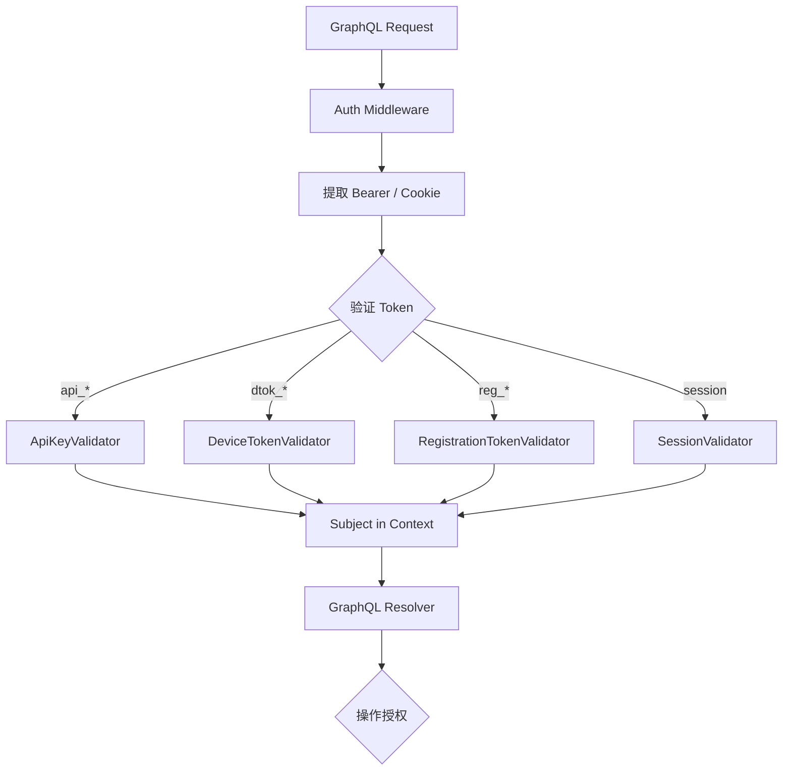

# 认证与授权

Schema Version: `1.0`

## 1. 概述

BuildDock 支持多种认证主体，统一通过 GraphQL HTTP Header 或 WebSocket `connection_init` 注入 context。

| 主体 | Token 前缀 | 用途 |
|------|-----------|------|
| API Key | `api_` | 触发方、Web Dashboard（MVP） |
| Device Token | `dtok_` | CLI Agent |
| Registration Token | `reg_` | 仅 `registerDevice` |
| Web Session | Cookie / JWT | V1.1 OAuth 登录 |

## 2. 认证架构



## 3. Subject 模型

```go
type Subject struct {
    Type   SubjectType  // APIKey, Device, Registration, User
    OrgID  string
    ID     string       // key_id / device_id / user_id
    Scopes []string     // V1.1
}
```

Resolver 通过 `auth.FromContext(ctx)` 获取，Service 层校验 org 隔离。

## 4. Token 设计

### 4.1 API Key

| 项 | 说明 |
|----|------|
| 格式 | `api_` + 32 字节 random base62 |
| 存储 | 仅存 SHA-256 哈希 |
| 展示 | 创建时一次性展示全文 |
| 识别 | `key_prefix` 前 8 字符 |

创建流程（Web / 管理 API）：

```
generate random → hash → INSERT api_keys → return plain key once
```

### 4.2 Device Token

| 项 | 说明 |
|----|------|
| 格式 | `dtok_` + random |
| 签发 | `registerDevice` 成功时 |
| 存储 | `devices.device_token_hash` |
| 绑定 | device_id + machine_id |

吊销：`revokeDevice` → 清 hash + status=REVOKED。

### 4.3 Registration Token

| 项 | 说明 |
|----|------|
| 格式 | `reg_` + random |
| 有效期 | 默认 1h |
| 一次性 | `used_at` 非空即失效 |
| 权限 | 仅允许 `registerDevice` mutation |

GraphQL directive（gqlgen）：

```graphql
directive @requiresRegistrationToken on FIELD_DEFINITION

type Mutation {
  registerDevice(input: RegisterDeviceInput!): DeviceRegistrationPayload!
    @requiresRegistrationToken
}
```

## 5. 操作授权矩阵（MVP）

| 操作 | API Key | Device Token | Registration Token |
|------|---------|--------------|-------------------|
| Query viewer, devices, tasks | ✅ 同 org | ❌ | ❌ |
| createTask, cancelTask | ✅ | ❌ | ❌ |
| createRegistrationToken, approveDevice | ✅ | ❌ | ❌ |
| registerDevice | ❌ | ❌ | ✅ |
| reportCapabilities, heartbeat, pollTask | ❌ | ✅ 仅自身 device | ❌ |
| acceptTask, completeTask, reportEvents | ❌ | ✅ 仅 assigned 任务 | ❌ |

Device Token 操作校验：

1. `input.deviceId` 必须等于 token 绑定的 device_id
2. `acceptTask/completeTask` 任务的 `assigned_device_id` 必须匹配

## 6. Web Dashboard 认证（MVP）

```
用户输入 API Key
  → localStorage.setItem('builddock_api_key', key)
  → query { viewer { orgId } } 验证
  → 失败则清除
```

V1.1 OAuth2：

```
/login → IdP → callback → Server 签发 HttpOnly session cookie
WebSocket connection_init 使用 cookie（同域）
```

## 7. GraphQL WebSocket 认证

```json
// connection_init payload
{
  "authorization": "Bearer api_xxx"
}
```

Server 与 HTTP 共用同一 Auth Middleware 逻辑。

## 8. 限流

| 主体 | 规则 |
|------|------|
| API Key | 100 createTask/min；300 query/min |
| Device Token | 1000 reportEvents/min；pollTask 无硬限 |
| IP | 1000 req/min（防 brute force） |

Redis key：`ratelimit:{type}:{id}:{window}`

## 9. 安全要求

| 项 | 措施 |
|----|------|
| 传输 | 生产强制 HTTPS / WSS |
| Token 日志 | 禁止记录完整 token |
| 哈希算法 | SHA-256（api/device token）；bcrypt 仅用于用户密码（V1.1） |
| CORS | Web 同域部署优先；跨域白名单 |
| CSRF | MVP API Key in Header 无 CSRF；OAuth 时 SameSite cookie |

## 10. Secrets 注入（任务执行）

API Key 用户创建任务时引用 `secretRefs`：

```
createTask → TaskService 解析 sec/npm_token
  → 从 secrets 表解密（V1.1）
  → pollTask 响应 resolvedSecrets（仅 Agent 可见）
  → completeTask 后内存清零，不持久化 resolvedSecrets
```

MVP 可无 secrets 表，env 直接写在 spec（不推荐生产）。

## 11. 审计日志（V1.1）

| 事件 | 记录 |
|------|------|
| api_key.created / revoked | audit_logs |
| device.registered / approved / revoked | audit_logs |
| task.created / cancelled | audit_logs |

MVP：结构化 slog 足够。

## 12. 实现位置（Go）

```
backend/internal/auth/
├── subject.go
├── middleware.go          # HTTP + WS
├── api_key.go
├── device_token.go
├── registration_token.go
└── rbac.go                # Can(subject, operation, resource)
```

Resolver 入口调用 `rbac.Enforce(ctx, "createTask")`，失败返回 `FORBIDDEN`。
