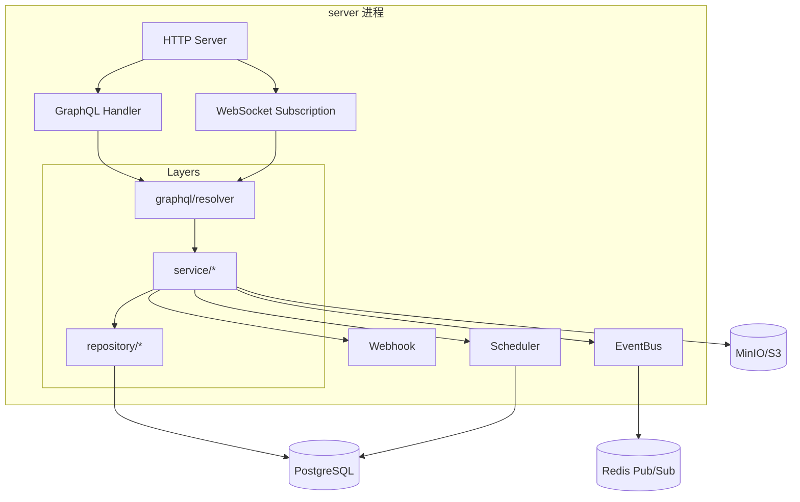
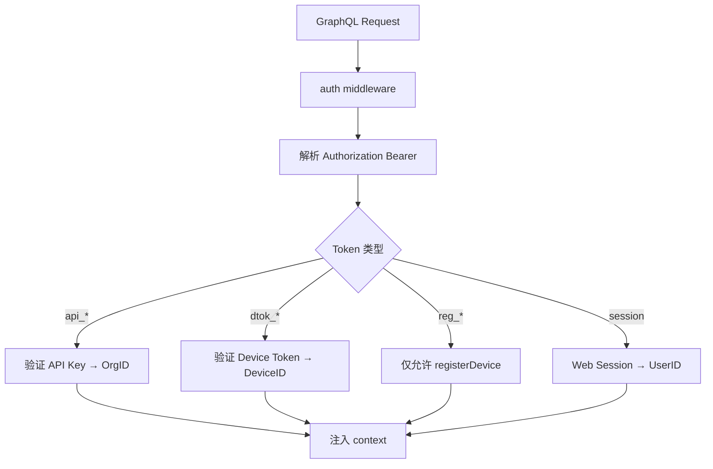

# 后端架构（Go）

## 1. 概述

后端为单一 Go 进程 `server`，对外暴露 GraphQL API，内部按**分层架构**组织：GraphQL 层 → Service 层 → Repository 层 → Domain。

| 属性 | 选择 |
|------|------|
| 语言 | Go 1.22+ |
| GraphQL 框架 | [gqlgen](https://github.com/99designs/gqlgen) |
| HTTP 路由 | gqlgen 内置 + chi（health/metrics 辅助路由） |
| ORM | [sqlc](https://sqlc.dev/) 或 [ent](https://entgo.io/)（推荐 sqlc：SQL 透明、性能好） |
| 数据库驱动 | pgx/v5 |
| 迁移 | golang-migrate |
| 配置 | koanf 或 envconfig |
| 日志 | slog（标准库） |
| 链路追踪 | OpenTelemetry（V1.1） |

## 2. 进程架构



MVP 为**单进程单体**：调度器、GraphQL、Subscription 同进程。任务量大时可拆 `scheduler-worker` 进程（V2）。

## 3. 包结构详解

```
backend/
├── cmd/server/main.go              # 入口：加载配置、DI、启动 HTTP
├── internal/
│   ├── config/config.go            # 环境变量 / 配置文件
│   ├── domain/                       # 领域模型（无外部依赖）
│   │   ├── device.go
│   │   ├── task.go
│   │   ├── capability.go
│   │   ├── lease.go
│   │   └── event.go
│   ├── repository/                   # 持久化接口 + 实现
│   │   ├── device.go
│   │   ├── task.go
│   │   ├── event.go
│   │   └── artifact.go
│   ├── service/                      # 业务逻辑
│   │   ├── device_service.go
│   │   ├── task_service.go
│   │   ├── agent_service.go          # Agent 专用：poll, heartbeat, complete
│   │   └── artifact_service.go
│   ├── scheduler/                    # 调度引擎
│   │   ├── matcher.go                # Placement 匹配
│   │   ├── lease_manager.go
│   │   ├── queue.go                  # PG SKIP LOCKED
│   │   └── worker.go                 # 后台 goroutine：匹配、超时、重试
│   ├── graphql/
│   │   ├── generated/                # gqlgen 生成（勿手改）
│   │   ├── resolver/
│   │   │   ├── schema.resolvers.go
│   │   │   ├── device.resolvers.go
│   │   │   ├── task.resolvers.go
│   │   │   ├── agent.resolvers.go
│   │   │   └── subscription.resolvers.go
│   │   ├── dataloader/               # N+1 优化
│   │   └── middleware/
│   │       ├── auth.go
│   │       └── ratelimit.go
│   ├── auth/
│   │   ├── api_key.go
│   │   ├── device_token.go
│   │   └── registration_token.go
│   ├── eventbus/
│   │   ├── bus.go                    # 接口
│   │   ├── redis_pubsub.go           # MVP
│   │   └── memory.go                 # 单测 / 本地
│   ├── webhook/
│   │   └── dispatcher.go
│   └── storage/
│       └── s3.go
├── migrations/
│   ├── 000001_init.up.sql
│   └── ...
└── gqlgen.yml
```

## 4. 分层职责

### 4.1 Domain 层

纯 Go struct + 方法，不依赖 gqlgen、pgx、Redis。

- 封装状态机转换规则（如 `Task.CanTransitionTo(status)`）
- Placement 匹配逻辑（`Matcher.Match(devices, placement)`）
- Lease 过期判断

Domain 层单元测试覆盖率目标 > 80%。

### 4.2 Repository 层

- 定义接口，sqlc/ent 实现
- 事务边界由 Service 控制
- 任务队列核心 SQL：

```sql
-- name: DequeueTask :one
SELECT * FROM tasks
WHERE runtime_status = 'QUEUED'
ORDER BY created_at
FOR UPDATE SKIP LOCKED
LIMIT 1;
```

### 4.3 Service 层

| Service | 职责 |
|---------|------|
| `DeviceService` | 注册、审批、Capability 更新、心跳 |
| `TaskService` | 创建、取消、查询；触发调度 |
| `AgentService` | `PollTask`（长轮询）、`AcceptTask`、`CompleteTask` |
| `ArtifactService` | 预签名 URL、确认上传 |
| `EventService` | 写入事件、推送 EventBus |

Service 之间通过接口注入，避免循环依赖。

### 4.4 GraphQL Resolver 层

- 薄层：参数校验 → 调用 Service → 映射 GraphQL 类型
- 不含业务逻辑
- Subscription resolver 订阅 EventBus channel

```go
// 示意（非实现代码，仅表达职责）
func (r *mutationResolver) CreateTask(ctx context.Context, input model.CreateTaskInput) (*model.Task, error) {
    subject := auth.SubjectFromContext(ctx)
    task, err := r.TaskService.Create(ctx, subject.OrgID, toDomainSpec(input))
    return toGraphQLTask(task), err
}
```

## 5. 核心流程设计

### 5.1 createTask

```
Resolver.CreateTask
  → TaskService.Create
      → 校验 spec + placement
      → 幂等检查（idempotency_key）
      → INSERT task (status=QUEUED)
      → EventBus.Publish(TaskCreated)
      → Scheduler.Enqueue(taskID)
  → 返回 Task
```

### 5.2 pollTask（长轮询）

```
Resolver.PollTask
  → AgentService.PollTask(ctx, deviceID, timeout)
      → 校验 DeviceToken + generation
      → 循环（直到 timeout）:
          → Scheduler.TryAssign(deviceID)  // 匹配 + lease
          → 有任务 → 解析 secrets → 返回
          → 无任务 → sleep 500ms
  → 返回 AssignedTask | null
```

长轮询在 **goroutine + context timeout** 内完成，不阻塞其他请求（Go net/http 每请求一 goroutine）。

### 5.3 reportEvents → Subscription

```
Resolver.ReportEvents
  → EventService.Append(taskID, events)
      → INSERT task_events
      → EventBus.Publish(TaskEvent{taskID, events})
  → Subscription resolver 收到 → 推送给 WebSocket 客户端
```

EventBus MVP 用 **Redis Pub/Sub**，channel：`builddock:events:{taskID}`。

### 5.4 调度器后台 Worker

独立 goroutine，职责：

| 周期 | 动作 |
|------|------|
| 1s | 扫描 QUEUED 任务，尝试 Match + Assign |
| 5s | 扫描过期 Lease → re-queue |
| 5s | 扫描 RUNNING 超时 → TIMED_OUT |
| 30s | 扫描 OFFLINE 设备 → 释放 assigned 任务 |

## 6. 认证设计



Resolver 通过 `auth.SubjectFromContext(ctx)` 获取调用方，Service 层做权限校验。

## 7. GraphQL 特定设计

### 7.1 gqlgen 配置要点

```yaml
# gqlgen.yml 关键项
schema:
  - ../api/graphql/schema.graphql
exec:
  layout: follow-schema
  dir: internal/graphql/generated
resolver:
  layout: follow-schema
  dir: internal/graphql/resolver
model:
  id: github.com/99designs/gqlgen/graphql.ID
```

### 7.2 DataLoader

避免 N+1：

| Loader | 批量加载 |
|--------|----------|
| `DeviceByID` | tasks.assignedDevice |
| `ArtifactsByTaskID` | task.result.artifacts |

### 7.3 Subscription

- 传输：`graphql-ws` 协议（gqlgen 内置支持）
- 鉴权：`connection_init` payload 带 Bearer Token
- 每个 Subscription 订阅 EventBus，客户端断开时 unsubscribe

## 8. 数据库表（概要）

| 表 | 用途 |
|----|------|
| `organizations` | 租户 |
| `api_keys` | API Key 哈希 |
| `devices` | 设备主表 |
| `device_capabilities` | 最新 Capability JSON |
| `registration_tokens` | 一次性注册 Token |
| `tasks` | 任务主表（spec/placement/runtime/result JSONB） |
| `task_leases` | Lease 记录 |
| `task_events` | 事件流 |
| `task_logs` | 日志行（或仅存 object storage） |
| `artifacts` | 产物元数据 |
| `webhook_deliveries` | Webhook 投递记录 |

详细表结构见后续 `docs/architecture/database.md`（待编写）。

## 9. 配置项

| 环境变量 | 说明 | 默认 |
|----------|------|------|
| `DATABASE_URL` | PostgreSQL DSN | 必填 |
| `REDIS_URL` | Redis DSN | 可选（无则 memory EventBus） |
| `S3_ENDPOINT` | 对象存储 | 必填 |
| `S3_BUCKET` | Bucket 名 | `builddock` |
| `HTTP_ADDR` | 监听地址 | `:8080` |
| `JWT_SECRET` / token 配置 | Token 签名 | 必填 |
| `WEBHOOK_TIMEOUT_SEC` | Webhook 超时 | `10` |

## 10. 可观测性

| 维度 | MVP | V1.1 |
|------|-----|------|
| 日志 | slog JSON | 结构化 + request_id |
| 指标 | Prometheus `/metrics` | Grafana |
| 健康 | `/healthz`、`/readyz` | K8s probe |
| 追踪 | — | OpenTelemetry |

## 11. 错误处理约定

- Domain/Service 返回 typed error：`ErrNotFound`、`ErrConflict`、`ErrValidation`
- Resolver 映射为 GraphQL error extensions.code
- 不向客户端泄露内部 stack trace

## 12. MVP 实现顺序建议

1. config + domain + migrations
2. repository（device, task）
3. auth（api key, device token）
4. service（device, task, agent）
5. gqlgen resolver（Query/Mutation）
6. scheduler worker
7. eventbus + Subscription
8. artifact + S3
9. webhook dispatcher
