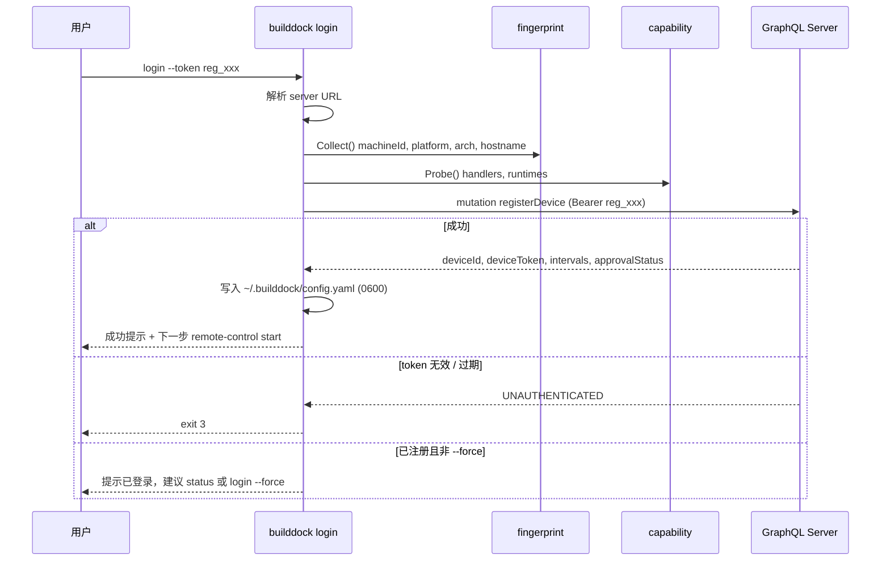
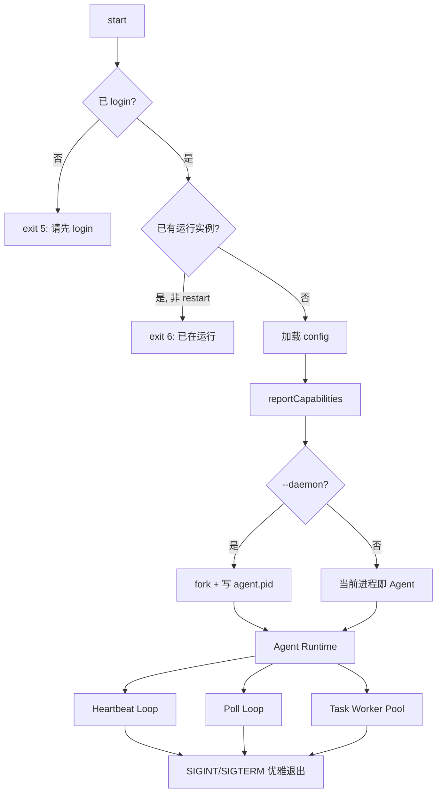
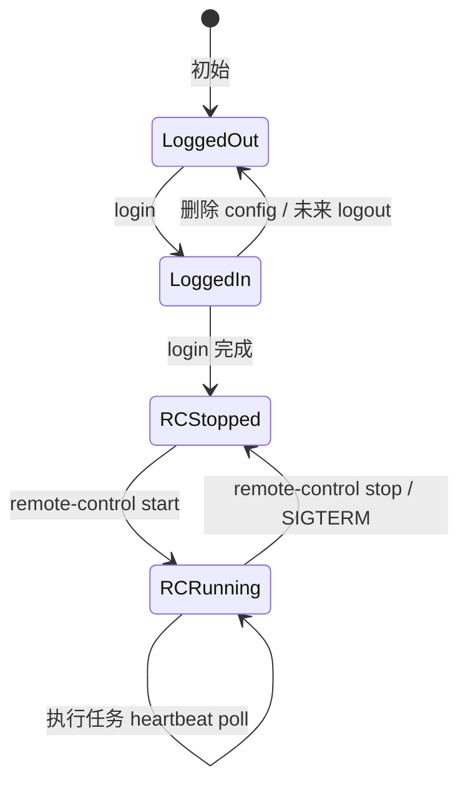

# CLI 命令设计

Schema Version: `1.0`

BuildDock 用户侧 CLI 以 **`builddock`** 为二进制名（构建产物可仍称 `builddock-agent`，见 [Monorepo](./monorepo.md)）。面向用户的顶层命令仅三个：

| 命令 | 职责 |
|------|------|
| `login` | 将本机接入平台：认证、注册设备、写入本地凭据 |
| `remote-control` | 启停 Agent 运行时，使平台可远程下发并执行任务 |
| `status` | 查看登录态、守护进程态、与服务端的连通性 |

另保留 **`version`** 作为辅助命令（版本与兼容性信息），不计入核心业务三命令。

> 本文只描述命令契约与行为，**不包含实现代码**。运行时、Executor、GraphQL Client 等见 [CLI 架构](./cli.md)。

---

## 1. 设计原则

| 原则 | 说明 |
|------|------|
| 三命令模型 | 用户心智：`登录 → 开启远程控制 → 随时查看状态` |
| 出站连接 | `remote-control` 运行后 Agent 主动连平台，设备无需开放入站端口 |
| 凭据与运行时分离 | `login` 写凭据；`remote-control` 消费凭据；二者可独立执行 |
| 幂等与可恢复 | 重复 `login`（同 machineId）走 upsert；`remote-control stop` 可安全多次调用 |
| 可脚本化 | 全命令支持 `--json`；非零 exit code 表示失败 |

### 1.1 与旧命令映射

| 旧命令（草案） | 新命令 |
|----------------|--------|
| `register` | `login` |
| `start` | `remote-control start` |
| `stop` | `remote-control stop` |
| `status` | `status`（增强） |

GraphQL 层不变：`login` 仍调用 `registerDevice`；`remote-control start` 仍走 heartbeat / pollTask 循环。

---

## 2. 本地状态模型

CLI 依赖三类本地文件，命令间通过它们协作：

```
~/.builddock/
├── config.yaml          # login 写入；remote-control / status 读取
├── agent.pid            # remote-control start --daemon 写入
├── agent.sock           # 可选：本机 IPC（V1.1，stop / status 查询）
└── spool/               # 事件离线缓冲（V1.1）
```

### 2.1 config.yaml（login 产出）

```yaml
# 必填（login 成功后）
graphql_url: https://api.builddock.example.com/graphql
device_id: dev_01JABC...
device_token: dtok_xxx          # 0600，不入日志

# 设备元数据
name: macbook-pro-m3
machine_id: a1b2c3...
platform: darwin
arch: arm64
hostname: dev-mac.local
labels:
  owner: alice

# 服务端下发（registerDevice 响应）
poll_interval_ms: 1000
heartbeat_interval_ms: 30000
approval_status: PENDING        # PENDING | APPROVED | REJECTED

# Agent 运行时（可选，有默认值）
working_dir: /tmp/builddock
max_concurrent_tasks: 3
log_level: info

# login 元信息
logged_in_at: "2026-07-30T12:00:00Z"
cli_version: "0.1.0"
```

| 字段 | 写入者 | 说明 |
|------|--------|------|
| `device_token` | `login` | Device Token，见 [认证](./auth.md) |
| `approval_status` | `login` + `status`（刷新） | 未 APPROVED 时 remote-control 可启动但 poll 可能无任务 |
| `poll_interval_ms` 等 | `login` | 服务端策略，remote-control 遵循 |

文件权限 **`0600`**。Token 禁止写入环境变量或日志。

### 2.2 运行时状态（内存 + 可选 PID）

| 状态 | 含义 | 检测方式 |
|------|------|----------|
| `not_logged_in` | 无有效 config | 缺 `device_token` |
| `logged_in` | 已登录 | config 完整 |
| `remote_control_stopped` | 已登录但 Agent 未运行 | 无 PID / 进程不存在 |
| `remote_control_running` | Agent 守护进程活跃 | PID 存活 + 可选 heartbeat 成功 |

---

## 3. `login`

### 3.1 用途

将**当前机器**注册到 BuildDock 组织，获取并持久化 Device Token，完成「本机已接入平台」的声明。

### 3.2 语法

```bash
builddock login [flags]
```

### 3.3 Flags

| Flag | 类型 | 必填 | 默认 | 说明 |
|------|------|------|------|------|
| `--token` | string | MVP 是 | — | Registration Token（`reg_xxx`），来自 Web「添加设备」 |
| `--server` | string | 否 | 内置默认 / `BUILDDOCK_SERVER` | GraphQL Endpoint 根 URL（自动补 `/graphql`） |
| `--name` | string | 否 | hostname | 设备展示名 |
| `--label` | string[] | 否 | — | `key=value`，可重复 |
| `--force` | bool | 否 | false | 覆盖已有 config（需确认或 `--yes`） |
| `--yes` | bool | 否 | false | 跳过交互确认 |
| `--json` | bool | 否 | false | JSON 输出 |
| `--no-probe` | bool | 否 | false | 跳过本机 capability 探测（仅用空 capabilities） |

### 3.4 交互模式（MVP 外）

| 阶段 | 行为 |
|------|------|
| MVP | 必须提供 `--token reg_xxx` |
| V1.1 | 无 token 时打开浏览器 OAuth；服务端签发短期 reg token 或直接返回 device token |
| V1.1 | 支持 `builddock login --check` 仅验证现有凭据 |

### 3.5 执行流程



步骤说明：

1. 若已有 config 且无 `--force`：打印警告并以 exit code `2` 退出（避免误覆盖 token）。
2. `fingerprint.Collect()` → 稳定 `machine_id`（同机重复 login 视为同一设备，服务端 upsert）。
3. `capability.Probe()` → 填充 `RegisterDeviceInput.capabilities`。
4. `registerDevice` mutation（Registration Token 认证）。
5. 合并响应与本地选项写入 `config.yaml`。
6. 根据 `approvalStatus` 输出后续指引（等待管理员 approve）。

### 3.6 GraphQL

```graphql
mutation LoginRegister($input: RegisterDeviceInput!) {
  registerDevice(input: $input) {
    device { id name approvalStatus status }
    deviceToken
    pollIntervalMs
    heartbeatIntervalMs
  }
}
```

认证：`Authorization: Bearer reg_xxx`（仅本 mutation）。

### 3.7 输出示例

**人类可读（成功）：**

```
✓ 设备已注册: macbook-pro-m3 (dev_01JABC...)
  审批状态: PENDING — 请在控制台批准后再接收任务
  下一步: builddock remote-control start
```

**JSON（`--json`）：**

```json
{
  "deviceId": "dev_01JABC",
  "name": "macbook-pro-m3",
  "approvalStatus": "PENDING",
  "graphqlUrl": "https://api.builddock.example.com/graphql",
  "loggedInAt": "2026-07-30T12:00:00Z"
}
```

### 3.8 退出码

| Code | 含义 |
|------|------|
| 0 | 成功 |
| 1 | 一般错误（网络、IO、未知 GraphQL 错误） |
| 2 | 已登录且未使用 `--force` |
| 3 | Token 无效或过期 |
| 4 | 服务端拒绝（如 org 配额、machine 被封禁） |

---

## 4. `remote-control`

### 4.1 用途

控制 **Agent 运行时**的启停。运行时负责：

- `reportCapabilities`（启动时全量 + 可选 periodic delta）
- `heartbeat` 循环
- `pollTask` 长轮询与任务执行
- 产物上传与 `completeTask`

即：开启后平台可「远程控制」本机执行 Agent 任务。

### 4.2 语法

```bash
builddock remote-control <subcommand> [flags]
```

| 子命令 | 说明 |
|--------|------|
| `start` | 启动 Agent（前台或守护进程） |
| `stop` | 停止本地 Agent |
| `restart` | stop + start（守护进程场景） |

无子命令时打印用法并以 exit `2` 退出。

### 4.3 前置条件

- 必须先 `login`（存在有效 `config.yaml` 与 `device_token`）
- `approval_status=REJECTED` 时：`start` 拒绝并提示联系管理员
- `PENDING` 时：允许 `start`（便于 heartbeat 与 capability 上报），但可能长时间 poll 不到任务

### 4.4 `remote-control start`

#### Flags

| Flag | 类型 | 默认 | 说明 |
|------|------|------|------|
| `--daemon` / `-d` | bool | false | 后台运行，写 PID 文件 |
| `--foreground` / `-f` | bool | true（与 -d 互斥） | 前台运行，日志到 stderr |
| `--working-dir` | string | config 或 `/tmp/builddock` | 任务工作目录根 |
| `--max-tasks` | int | config 或 `3` | 覆盖 `max_concurrent_tasks` |
| `--log-level` | string | config 或 `info` | debug / info / warn / error |
| `--json` | bool | false | 仅 daemon 模式下启动结果 JSON |

#### 执行流程



Runtime 行为见 [CLI 架构 §5](./cli.md#5-agent-runtime-设计)。

**守护进程模式：**

- PID 写入 `~/.builddock/agent.pid`
- 父进程在确认 Runtime 初始化成功后退出（如首次 heartbeat 成功或 5s 内无 fatal）
- 重复 `start --daemon` 检测 PID 存活则拒绝

**优雅退出（`stop` 或 SIGTERM）：**

1. 停止接受新 poll 任务（`available_slots=0`）
2. 等待 running 任务完成，或 `--shutdown-timeout`（默认 120s）后 cancel
3. 刷新 event spool（若有）
4. 删除 PID 文件

### 4.5 `remote-control stop`

#### Flags

| Flag | 类型 | 默认 | 说明 |
|------|------|------|------|
| `--timeout` | duration | `120s` | 等待任务结束的最长时间 |
| `--json` | bool | false | JSON 输出 |

#### 行为

1. 读取 `agent.pid`；不存在 → 成功退出（幂等）
2. 向进程发 SIGTERM；超时发 SIGKILL
3. 清理 PID 文件

前台 `start` 场景：提示用户在对应终端 Ctrl+C（无法跨会话 stop）。

### 4.6 `remote-control restart`

等价于 `stop`（忽略未运行）+ `start --daemon`（保留原 daemon 标志需 V1.1 记录；MVP 默认 restart 使用 daemon）。

### 4.7 GraphQL（运行时）

| 阶段 | Mutation |
|------|----------|
| 启动 | `reportCapabilities` |
| 循环 | `heartbeat`, `pollTask` |
| 任务 | `acceptTask`, `renewLease`, `reportEvents`, `prepareArtifactUpload`, `confirmArtifactUpload`, `completeTask` |

认证：`Authorization: Bearer dtok_xxx`（Device Token）。

### 4.8 退出码

| Code | 含义 |
|------|------|
| 0 | 成功 |
| 1 | 一般错误 |
| 5 | 未 login |
| 6 | Agent 已在运行（重复 start） |
| 7 | 审批被拒绝 |
| 8 | 与服务端版本不兼容（警告性，MVP 不阻断） |

---

## 5. `status`

### 5.1 用途

汇总 **登录态**、**remote-control 运行态**、**服务端连通性** 与 **设备在平台侧快照**，供用户与脚本诊断。

### 5.2 语法

```bash
builddock status [flags]
```

### 5.3 Flags

| Flag | 类型 | 默认 | 说明 |
|------|------|------|------|
| `--json` | bool | false | 机器可读输出 |
| `--refresh` | bool | false | 向服务端拉取最新 device 状态（需已 login） |
| `--watch` | bool | false | 每 5s 刷新（TUI 简版，V1.1） |

### 5.4 信息源

| 信息 | 来源 |
|------|------|
| 是否已 login | 本地 config |
| Agent 是否运行 | PID 文件 + 进程检测 |
| 本机版本 | 嵌入 `cli_version` |
| 审批 / 在线状态 | 本地缓存；`--refresh` 时 Query |
| 当前任务数 | 本地 Runtime 统计；`--refresh` 可选 Query |
| 上次 heartbeat | 本地 Runtime 写入 config 侧车或内存（daemon 通过文件 `agent.state.json`） |

V1.1 可增加 `~/.builddock/agent.state.json`（Runtime 周期写入，供 status 无 RPC 读取）。

### 5.5 `--refresh` GraphQL

```graphql
query DeviceStatus($id: ID!) {
  device(id: $id) {
    id
    name
    status
    approvalStatus
    lastHeartbeatAt
    capabilities { handlers runtimes }
  }
}
```

Device Token **无 Query 权限**时（MVP 矩阵）：`--refresh` 改用轻量 mutation：

```graphql
mutation StatusPing($input: HeartbeatInput!) {
  heartbeat(input: $input) {
    device { status approvalStatus lastHeartbeatAt }
    serverTime
  }
}
```

不增加新 API；heartbeat 响应携带必要字段即可。

### 5.6 输出示例

**人类可读：**

```
BuildDock CLI 0.1.0

登录:     已登录 (dev_01JABC..., macbook-pro-m3)
服务端:   https://api.builddock.example.com/graphql
审批:     APPROVED

远程控制: 运行中 (pid 12345,  since 2h ago)
任务:     1 running / 3 max slots
上次心跳: 12s ago (ok)

提示: builddock remote-control stop
```

**JSON：**

```json
{
  "loggedIn": true,
  "deviceId": "dev_01JABC",
  "name": "macbook-pro-m3",
  "approvalStatus": "APPROVED",
  "remoteControl": {
    "running": true,
    "pid": 12345,
    "since": "2026-07-30T10:00:00Z",
    "runningTasks": 1,
    "maxConcurrentTasks": 3
  },
  "server": {
    "graphqlUrl": "https://api.builddock.example.com/graphql",
    "reachable": true,
    "lastHeartbeatAt": "2026-07-30T12:43:18Z"
  }
}
```

### 5.7 退出码

| Code | 含义 |
|------|------|
| 0 | 已登录且（若曾 start）Agent 正常 |
| 1 | 一般错误 |
| 10 | 未 login |
| 11 | 已 login 但 Agent 未运行（仅警告性，仍可用 0 + 输出说明；若需脚本区分则用 `--json` 字段） |

> 脚本建议：用 `--json` 解析 `loggedIn` / `remoteControl.running`，勿依赖 exit 11。

---

## 6. 命令协作关系



典型用户旅程：

```bash
# 1. Web 生成 reg token 后
builddock login --token reg_xxx --name "office-linux"

# 2. 管理员 Web 批准设备

# 3. 开启远程控制（生产常用 daemon）
builddock remote-control start --daemon

# 4. 随时检查
builddock status --refresh
```

---

## 7. 包结构（cobra 映射）

```
cli/internal/cmd/
├── root.go
├── login.go              # login
├── remote_control.go     # remote-control 父命令
├── remote_control_start.go
├── remote_control_stop.go
├── remote_control_restart.go
├── status.go
└── version.go
```

`login` 依赖：`config`、`fingerprint`、`capability`、`client`（registerDevice）。

`remote-control` 依赖：`config`、`client`、`agent/runtime`、`executor`、`artifact`。

`status` 依赖：`config`、可选 `client`（refresh）、本地 PID/state。

---

## 8. Web / 文档中的安装指引

Web「添加设备」页应展示：

```bash
curl -fsSL https://get.builddock.example.com/install.sh | sh
builddock login --token <REG_TOKEN> --name "<DEVICE_NAME>"
builddock remote-control start --daemon
builddock status
```

Registration Token 一次性；过期后需重新生成并 `login --force`。

---

## 9. 安全与权限

| 项 | 说明 |
|----|------|
| login | 仅持有 `reg_` 者可注册；token 泄露窗口短 |
| remote-control | 持有 device config 的用户可启动 Agent；任务执行受平台 RBAC + trustLevel 约束 |
| 多用户机器 | config 属当前 OS 用户；不建议共享 `~/.builddock` |
| 卸载 | 停止 Agent + 删除 `~/.builddock` + Web 上 revoke device |

---

## 10. MVP 实现顺序建议

1. `config` 读写 + `login`（registerDevice）
2. `status`（仅本地，无 refresh）
3. `remote-control start` 前台 + Runtime 最小闭环
4. `remote-control stop` / `--daemon` + PID
5. `status --refresh`（heartbeat 捎带）
6. 安装脚本与 Web 指引文案对齐

---

## 11. 相关文档

- [CLI 架构](./cli.md) — Runtime、Executor、GraphQL Client
- [认证与授权](./auth.md) — Token 类型与 RBAC
- [Agent 协议](../product/agent-protocol.md) — Mutation 细节
- [端到端集成](./integration.md) — 三端联调链路
