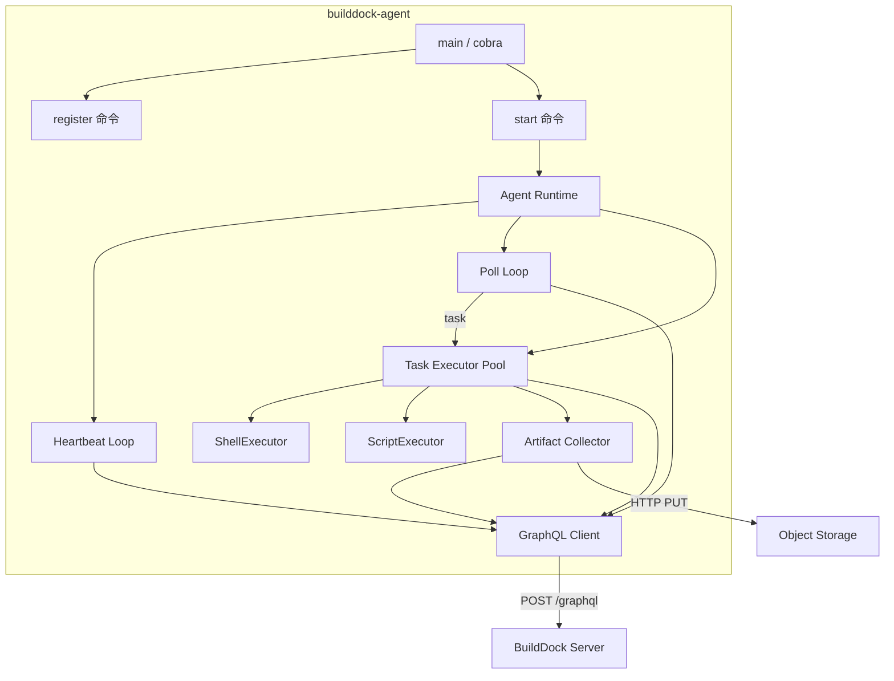
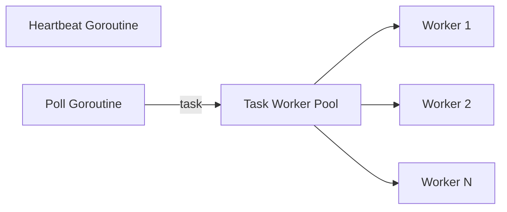

# CLI Agent 架构（Go）

## 1. 概述

`builddock-agent` 是运行在用户设备上的轻量守护进程，通过 **GraphQL Mutation** 与平台通信，本地执行任务并回传结果。

| 属性 | 选择 |
|------|------|
| 语言 | Go 1.22+ |
| CLI 框架 | [cobra](https://github.com/spf13/cobra) |
| 配置 | YAML（`~/.builddock/config.yaml`） |
| GraphQL 客户端 | 标准库 `net/http` + JSON（MVP）；可选 `shurcooL/graphql` |
| 日志 | slog |
| 安装 | 单静态二进制；可选 systemd / launchd |

## 2. 进程架构



## 3. 包结构

```
cli/
├── cmd/builddock-agent/
│   └── main.go                     # cobra root
├── internal/
│   ├── cmd/
│   │   ├── root.go
│   │   ├── register.go
│   │   ├── start.go
│   │   ├── status.go
│   │   └── stop.go
│   ├── config/
│   │   └── config.go               # 读写 ~/.builddock/config.yaml
│   ├── client/
│   │   ├── graphql.go              # GraphQL POST 封装
│   │   └── mutations.go            # 各 mutation 的请求/响应 struct
│   ├── agent/
│   │   ├── runtime.go              # 主循环 orchestrator
│   │   ├── heartbeat.go
│   │   ├── poller.go               # pollTask 长轮询
│   │   └── task_runner.go          # 单任务生命周期
│   ├── executor/
│   │   ├── executor.go             # 接口
│   │   ├── registry.go             # type → executor 映射
│   │   ├── shell.go
│   │   └── script.go
│   ├── capability/
│   │   ├── probe.go                # 探测 runtimes、handlers
│   │   └── report.go               # 构造 CapabilityReport
│   ├── fingerprint/
│   │   └── fingerprint.go          # machine_id, platform, arch
│   ├── artifact/
│   │   ├── collector.go            # glob 收集
│   │   └── uploader.go             # prepare → PUT → confirm
│   └── event/
│       └── reporter.go             # 缓冲 + 批量 reportEvents
└── go.mod
```

## 4. 命令设计

| 命令 | 说明 |
|------|------|
| `builddock-agent register` | 首次注册设备 |
| `builddock-agent start` | 启动守护进程（前台或 `--daemon`） |
| `builddock-agent status` | 打印本地配置与连接状态 |
| `builddock-agent stop` | 停止本地 daemon（写 PID 文件） |
| `builddock-agent version` | 版本信息 |

### 4.1 register 流程

```
1. 读取 --token / --name / --labels
2. fingerprint.Collect() → machineId, platform, arch, hostname
3. capability.Probe() → handlers, runtimes
4. client.RegisterDevice(input)
5. 写入 config.yaml（device_id, device_token, graphql_url）
6. 提示：等待管理员 approve（若 approvalStatus=PENDING）
```

### 4.2 start 流程

```
1. 加载 config.yaml
2. capability.ReportFull() → reportCapabilities
3. 启动 heartbeat goroutine（每 heartbeatIntervalMs）
4. 启动 poll loop（主 goroutine 或 worker pool）
5. 监听 SIGINT/SIGTERM → 优雅退出（等待 running 任务完成或超时）
```

## 5. Agent Runtime 设计

### 5.1 并发模型



| 组件 | 数量 | 说明 |
|------|------|------|
| Heartbeat | 1 goroutine | 固定间隔 |
| Poll | 1 goroutine | 长轮询；无任务立即重 poll |
| Task Worker | `max_concurrent_tasks` | 每任务独立 goroutine |

`available_slots = max_concurrent_tasks - running_count`，传给 `pollTask`。

### 5.2 单任务生命周期（TaskRunner）

```
1. acceptTask(leaseId, generation)
2. 启动 renewLease ticker（lease 过期前 50%）
3. 选择 Executor（by spec.type）
4. 构造 ExecEnv（working_dir, env, resolvedSecrets, EventReporter）
5. executor.Execute(ctx, spec, env)
   → stdout/stderr 逐行 → reportEvents(LOG)
   → 可选 progress → reportEvents(PROGRESS)
6. artifact.Collector.Collect(spec.artifactCollect)
7. artifact.Uploader.Upload → prepareArtifactUpload → PUT → confirm
8. completeTask(result)
9. 停止 renewLease ticker
```

### 5.3 取消处理

MVP：heartbeat 响应或 poll 间隙检查任务 `cancelRequested`（通过额外 query 或 poll 附带信息）。

V2：GraphQL Subscription 接收 `taskCancel` 信号。

收到 cancel → context.Cancel → kill 进程 → completeTask(CANCELLED)。

## 6. Executor 设计

### 6.1 接口

```go
type Executor interface {
    Type() string
    Execute(ctx context.Context, spec TaskSpec, env *ExecEnv) (*ExecResult, error)
}

type ExecEnv struct {
    WorkingDir string
    Env        map[string]string
    Secrets    map[string]string
    Events     EventReporter
}
```

### 6.2 ShellExecutor

- 解析 `payload.command`、`payload.shell`、`payload.cwd`
- `exec.CommandContext(ctx, shell, "-c", command)`
- stdout/stderr pipe → 按行 Events.Log

### 6.3 ScriptExecutor

- 解析 `source.kind`：
  - `inline`：写临时文件，`chmod +x`，执行
  - `url`：下载后执行（V1.1）
- 根据 `language` 选择解释器（bash/python/node）

### 6.4 Registry

```go
type Registry struct {
    executors map[string]Executor
}
func (r *Registry) Get(taskType string) (Executor, error)
```

启动时注册 MVP executors；V2 可插件化加载 `.so`（非 MVP）。

## 7. GraphQL Client 设计

### 7.1 最小实现（MVP）

```go
type Client struct {
    Endpoint string
    Token    string
    HTTP     *http.Client  // Timeout: poll timeout + buffer
}

func (c *Client) Mutate(ctx context.Context, query string, variables any, result any) error
```

- 统一 POST `{"query": "...", "variables": {...}}`
- 解析 `errors[]`，映射为 Go error
- `pollTask` 使用较长 context timeout（如 35s）

### 7.2 Mutation 封装

| 方法 | GraphQL Mutation |
|------|------------------|
| `RegisterDevice` | `registerDevice` |
| `ReportCapabilities` | `reportCapabilities` |
| `Heartbeat` | `heartbeat` |
| `PollTask` | `pollTask` |
| `AcceptTask` | `acceptTask` |
| `RenewLease` | `renewLease` |
| `ReportEvents` | `reportEvents` |
| `PrepareArtifactUpload` | `prepareArtifactUpload` |
| `ConfirmArtifactUpload` | `confirmArtifactUpload` |
| `CompleteTask` | `completeTask` |

## 8. Event Reporter

- 内存 buffer，按条或按时间 flush（如 100ms / 50 条）
- flush → `reportEvents` mutation
- 网络失败：本地 spool 文件（`~/.builddock/spool/`），重试（V1.1）

## 9. 本地配置

`~/.builddock/config.yaml`：

```yaml
graphql_url: https://api.builddock.example.com/graphql
device_id: dev_01JABC...
device_token: dtok_xxx
name: macbook-pro-m3
working_dir: /tmp/builddock
max_concurrent_tasks: 3
log_level: info
# 可选
labels:
  owner: alice
```

文件权限 `0600`。Token 不入环境变量、不写日志。

## 10. 安全

完整清单见 [安全架构](./security.md) 与 [安全要求](../product/security.md)。Agent 侧 MVP 必做：

| 项 | 措施 |
|----|------|
| Token | 仅 config 文件，0600 |
| Secrets | `resolvedSecrets` 仅任务执行期在内存 |
| 命令注入 | 不拼接 shell；`exec.CommandContext` + 参数分离 |
| 不受信任务 | `trustLevel=UNTRUSTED` 默认拒绝 |
| 工作目录 | 每任务独立 workspace；防路径穿越 |
| 环境变量 | 默认不继承用户 shell |
| 超时 | `spec.timeout` → kill 进程树 |
| 非 root | 文档建议以普通 OS 用户运行 Agent |

V2：sandbox 包装 Executor，见 [安全架构 §4.4](./security.md#44-sandboxv2)。

## 11. 跨平台

| 平台 | fingerprint | 安装 |
|------|-------------|------|
| Linux | `/etc/machine-id` | systemd unit |
| macOS | IOPlatformUUID | launchd plist |
| Windows | MachineGuid | Windows Service（V1.1） |

## 12. 与 Backend 的版本兼容

Agent 启动时可选调用：

```graphql
query { viewer { orgId } }
```

并比对 Server 响应头 `X-BuildDock-Version`。维护兼容矩阵文档。

## 13. MVP 实现顺序建议

1. config + fingerprint + capability probe
2. graphql client + register
3. executor（shell, script）+ event reporter
4. agent runtime（heartbeat + poll + task runner）
5. artifact uploader
6. cobra commands + daemon 模式
7. 交叉编译 + install script
