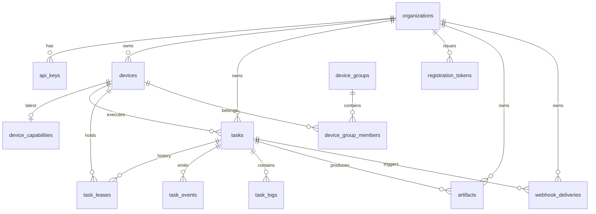
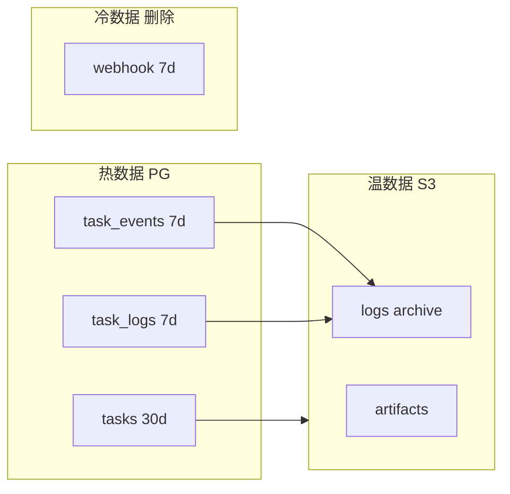

# 数据库设计（PostgreSQL）

Schema Version: `1.0`

## 文档导航

| 文档 | 内容 |
|------|------|
| [字段字典](./database-tables.md) | 每张表逐列说明、约束、GraphQL 映射 |
| [JSONB 结构约定](./database-jsonb.md) | spec/placement/result/capability JSON 格式 |
| [sqlc 查询目录](./database-queries.md) | 全部 Repository 查询与事务边界 |
| [Init DDL](./migrations/000001_init.sql) | 完整初始化 SQL（设计参考） |

---

## 1. 设计原则

| 原则 | 说明 |
|------|------|
| PostgreSQL 16 | 主存储 + 任务队列（`FOR UPDATE SKIP LOCKED`） |
| ID | 应用层 ULID，前缀 `org_`/`dev_`/`task_` 等 |
| JSONB | spec、placement、capability；camelCase 键名 |
| 枚举 | PG enum = GraphQL enum（SCREAMING_SNAKE_CASE） |
| 迁移 | golang-migrate；设计参考 SQL 在 `migrations/` |
| 访问层 | sqlc 生成类型安全 Go 代码 |
| _denorm_ | `tasks.spec_type` 等生成列便于索引 |

---

## 2. ER 关系



---

## 3. 表清单

### 3.1 MVP（11 表 + 1 视图）

| 表 / 视图 | 行量级（估算） | 说明 |
|-----------|---------------|------|
| `organizations` | 1–100 | 租户 |
| `api_keys` | 10–1000 | API 认证 |
| `registration_tokens` | 短期 | 一次性注册 |
| `devices` | 10–10k | 注册设备 |
| `device_capabilities` | = devices | 1:1 最新能力 |
| `tasks` | 100k–1M+ | 核心表 |
| `task_leases` | ≈ tasks × 1.2 | Lease 历史 |
| `task_events` | tasks × 100+ | 高增长，需 retention |
| `task_logs` | tasks × 1000+ | 最高增长 |
| `artifacts` | tasks × 0–5 | 产物元数据 |
| `webhook_deliveries` | tasks × 1–5 | 回调记录 |
| `v_schedulable_devices` | 视图 | 调度器用 |

### 3.2 V1.1

| 表 | 说明 |
|----|------|
| `device_groups` | 设备组 |
| `device_group_members` | 组成员 |
| `secrets` | 加密密钥 |

---

## 4. 枚举类型

```sql
device_status       PENDING | ONLINE | OFFLINE | DRAINING | REVOKED
approval_status     PENDING | APPROVED | REJECTED
task_status         PENDING | QUEUED | ASSIGNING | ASSIGNED | RUNNING
                    | SUCCEEDED | FAILED | CANCELLED | TIMED_OUT | EXPIRED
task_event_type     STATUS_CHANGED | LOG | PROGRESS | ARTIFACT | METRIC | TOOL_CALL | HEARTBEAT
log_stream          STDOUT | STDERR
webhook_delivery_status  PENDING | SUCCESS | FAILED
```

完整 DDL 见 [`migrations/000001_init.sql`](./migrations/000001_init.sql)。

---

## 5. 核心表关系说明

### tasks ↔ devices

- `tasks.assigned_device_id` → `devices.id`（SET NULL on delete）
- 调度：从 `v_schedulable_devices` 选设备 → `AssignTaskToDevice`
- 离线：`devices.status=OFFLINE` → re-queue 该设备 ASSIGNED 任务

### tasks ↔ task_leases

- `tasks.lease_id` 指向当前有效 lease
- `task_leases` 保留全历史（审计、调试）
- 每 task 最多一条 `released_at IS NULL`

### task_events vs task_logs

| | task_events | task_logs |
|---|-------------|-----------|
| 用途 | Subscription、Webhook、审计 | `Task.logs` 查询 |
| 类型 | 多种 event_type | 仅 STDOUT/STDERR 行 |
| 写入 | reportEvents | LOG 事件双写（可选） |
| 体积 | 中 | 大 |

---

## 6. 索引策略摘要

| 表 | 关键索引 | 服务查询 |
|----|----------|----------|
| tasks | `(org_id, runtime_status, created_at DESC)` | 列表过滤 |
| tasks | `(created_at ASC) WHERE QUEUED` | FIFO 调度 |
| tasks | `(lease_expires_at) WHERE ASSIGNED` | Lease sweeper |
| devices | GIN `(labels)` | 标签路由 `@>` |
| devices | `(org_id) WHERE schedulable` | 调度候选 |
| task_events | `(task_id, created_at)` | Subscription 追平 |
| task_logs | `(task_id, id)` | 日志分页 |

---

## 7. 数据生命周期



| 数据 | 热存储 | Retention |
|------|--------|-----------|
| tasks（终态） | PG | 90 天 → 归档 JSON |
| task_events | PG | 7–30 天 |
| task_logs | PG | 7 天 → S3 |
| artifacts 文件 | S3 | 按 org 策略 |
| webhook_deliveries | PG | SUCCESS 7 天删除 |

---

## 8. 与 Redis / S3 分工

| 数据 | 存储 |
|------|------|
| 全部上表 | PostgreSQL |
| Subscription fan-out | Redis Pub/Sub |
| 限流 | Redis INCR |
| 产物/日志归档 | S3 |

---

## 9. 迁移计划

| 文件 | 内容 |
|------|------|
| `000001_init.sql` | 枚举、表、索引、视图、trigger |
| `000002_seed_dev.sql` | 默认 org（可选） |
| `000003_device_groups.sql` | V1.1 |

设计参考 DDL：[`migrations/000001_init.sql`](./migrations/000001_init.sql)

---

## 10. 相关文档

- [调度器设计](./scheduler.md) — 如何使用队列 SQL
- [认证与授权](./auth.md) — api_keys / token_hash
- [后端架构](./backend.md) — Repository 层位置
