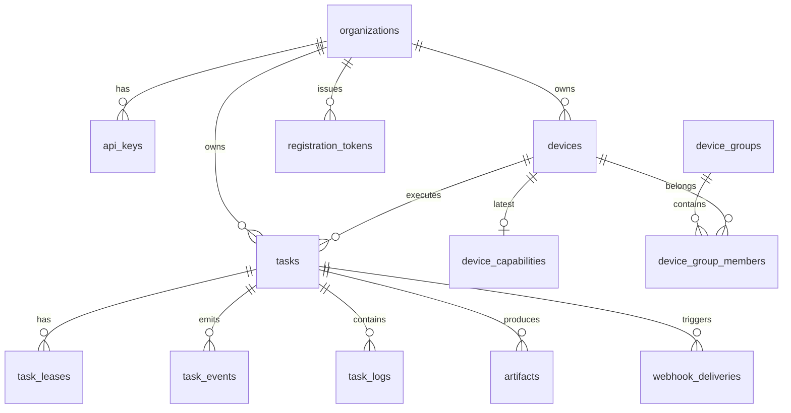

# 数据库设计（PostgreSQL）

Schema Version: `1.0`

## 1. 设计原则

| 原则 | 说明 |
|------|------|
| PostgreSQL 16 | 主存储 + 任务队列（`SKIP LOCKED`） |
| ID 前缀 | `org_`、`dev_`、`task_` 等，应用层生成（ULID/UUID v7） |
| JSONB | `spec`、`placement`、capability 等半结构化字段 |
| 枚举 | PG enum 与 GraphQL enum 同名（SCREAMING_SNAKE_CASE） |
| 迁移 | golang-migrate，文件名 `00000N_description.up.sql` |
| 访问层 | sqlc 生成类型安全查询（推荐） |

## 2. ER 关系



## 3. 枚举类型

```sql
CREATE TYPE device_status AS ENUM (
  'PENDING', 'ONLINE', 'OFFLINE', 'DRAINING', 'REVOKED'
);

CREATE TYPE approval_status AS ENUM (
  'PENDING', 'APPROVED', 'REJECTED'
);

CREATE TYPE task_status AS ENUM (
  'PENDING', 'QUEUED', 'ASSIGNING', 'ASSIGNED',
  'RUNNING', 'SUCCEEDED', 'FAILED', 'CANCELLED', 'TIMED_OUT', 'EXPIRED'
);

CREATE TYPE task_event_type AS ENUM (
  'STATUS_CHANGED', 'LOG', 'PROGRESS', 'ARTIFACT',
  'METRIC', 'TOOL_CALL', 'HEARTBEAT'
);

CREATE TYPE log_stream AS ENUM ('STDOUT', 'STDERR');

CREATE TYPE webhook_delivery_status AS ENUM (
  'PENDING', 'SUCCESS', 'FAILED'
);
```

## 4. 表定义

### 4.1 organizations

```sql
CREATE TABLE organizations (
    id          TEXT PRIMARY KEY,          -- org_01J...
    name        TEXT NOT NULL,
    created_at  TIMESTAMPTZ NOT NULL DEFAULT now(),
    updated_at  TIMESTAMPTZ NOT NULL DEFAULT now()
);
```

MVP 可仅有一个默认 org，V1.1 多租户。

### 4.2 api_keys

```sql
CREATE TABLE api_keys (
    id          TEXT PRIMARY KEY,          -- key_01J...
    org_id      TEXT NOT NULL REFERENCES organizations(id),
    name        TEXT NOT NULL,
    key_hash    TEXT NOT NULL UNIQUE,      -- SHA-256(api_key)
    key_prefix  TEXT NOT NULL,             -- 前 8 位，便于识别 api_abcd...
    last_used_at TIMESTAMPTZ,
    revoked_at  TIMESTAMPTZ,
    created_at  TIMESTAMPTZ NOT NULL DEFAULT now()
);

CREATE INDEX idx_api_keys_org ON api_keys(org_id) WHERE revoked_at IS NULL;
```

### 4.3 registration_tokens

```sql
CREATE TABLE registration_tokens (
    id          TEXT PRIMARY KEY,
    org_id      TEXT NOT NULL REFERENCES organizations(id),
    token_hash  TEXT NOT NULL UNIQUE,
    labels      JSONB NOT NULL DEFAULT '{}',
    expires_at  TIMESTAMPTZ NOT NULL,
    used_at     TIMESTAMPTZ,
    used_by_device_id TEXT,
    created_at  TIMESTAMPTZ NOT NULL DEFAULT now()
);

CREATE INDEX idx_reg_tokens_expires ON registration_tokens(expires_at)
  WHERE used_at IS NULL;
```

### 4.4 devices

```sql
CREATE TABLE devices (
    id              TEXT PRIMARY KEY,      -- dev_01J...
    org_id          TEXT NOT NULL REFERENCES organizations(id),
    name            TEXT NOT NULL,
    status          device_status NOT NULL DEFAULT 'PENDING',
    approval_status approval_status NOT NULL DEFAULT 'PENDING',

    -- fingerprint（immutable after register）
    machine_id      TEXT NOT NULL,
    hostname        TEXT NOT NULL,
    platform        TEXT NOT NULL,
    arch            TEXT NOT NULL,

    labels          JSONB NOT NULL DEFAULT '{}',

    -- agent 连接信息
    agent_version   TEXT,
    agent_cli       TEXT DEFAULT 'builddock-agent',
    connected_at    TIMESTAMPTZ,
    last_seen_at    TIMESTAMPTZ,

    -- 调度用动态字段（心跳更新）
    generation      INT NOT NULL DEFAULT 0,
    available_slots INT NOT NULL DEFAULT 1,
    active_tasks    INT NOT NULL DEFAULT 0,

    device_token_hash TEXT,                -- SHA-256(dtok_...)
    revoked_at      TIMESTAMPTZ,
    created_at      TIMESTAMPTZ NOT NULL DEFAULT now(),
    updated_at      TIMESTAMPTZ NOT NULL DEFAULT now(),

    UNIQUE (org_id, machine_id)
);

CREATE INDEX idx_devices_org_status ON devices(org_id, status);
CREATE INDEX idx_devices_org_approval ON devices(org_id, approval_status)
  WHERE approval_status = 'PENDING';
CREATE INDEX idx_devices_labels ON devices USING GIN (labels);
CREATE INDEX idx_devices_online ON devices(org_id, last_seen_at)
  WHERE status = 'ONLINE' AND approval_status = 'APPROVED';
```

### 4.5 device_capabilities

每次全量上报插入新行，查询时取最新；或 UPSERT 仅保留一行（MVP 推荐 UPSERT）。

```sql
CREATE TABLE device_capabilities (
    device_id       TEXT PRIMARY KEY REFERENCES devices(id) ON DELETE CASCADE,
    schema_version  TEXT NOT NULL DEFAULT '1.0',
    generation      INT NOT NULL,
    reported_at     TIMESTAMPTZ NOT NULL,

    system          JSONB,
    resources       JSONB,
    load            JSONB,                 -- cpuUsage, memoryUsage, ...
    network         JSONB,
    runtimes        JSONB,                 -- [{name, version}]
    handlers        JSONB,                 -- [{type, version, enabled, ...}]
    labels          JSONB NOT NULL DEFAULT '{}',
    constraints     JSONB,

    updated_at      TIMESTAMPTZ NOT NULL DEFAULT now()
);

CREATE INDEX idx_device_cap_handlers ON device_capabilities USING GIN (handlers);
CREATE INDEX idx_device_cap_runtimes ON device_capabilities USING GIN (runtimes);
```

### 4.6 tasks

核心表：spec/placement 创建时写入，runtime/result 随生命周期更新。

```sql
CREATE TABLE tasks (
    id              TEXT PRIMARY KEY,      -- task_01J...
    org_id          TEXT NOT NULL REFERENCES organizations(id),

    schema_version  TEXT NOT NULL DEFAULT '1.0',

    -- 不可变
    spec            JSONB NOT NULL,        -- TaskSpec
    placement       JSONB NOT NULL,        -- Placement

    -- 可变 runtime
    runtime_status  task_status NOT NULL DEFAULT 'PENDING',
    attempt         INT NOT NULL DEFAULT 1,
    assigned_device_id TEXT REFERENCES devices(id),
    cancel_requested BOOLEAN NOT NULL DEFAULT false,
    failure_reason  TEXT,

    -- lease（当前有效 lease，历史在 task_leases）
    lease_id        TEXT,
    lease_generation INT,
    lease_expires_at TIMESTAMPTZ,

    -- 时间戳
    queued_at       TIMESTAMPTZ,
    assigned_at     TIMESTAMPTZ,
    started_at      TIMESTAMPTZ,
    finished_at     TIMESTAMPTZ,
    deadline_at     TIMESTAMPTZ,

    -- 结果
    result          JSONB,                 -- TaskResult

    -- 幂等
    idempotency_key TEXT,

    -- 审计
    created_by      JSONB,                 -- {type, id, subject}
    created_at      TIMESTAMPTZ NOT NULL DEFAULT now(),
    updated_at      TIMESTAMPTZ NOT NULL DEFAULT now()
);

CREATE UNIQUE INDEX idx_tasks_idempotency
  ON tasks(org_id, idempotency_key) WHERE idempotency_key IS NOT NULL;

CREATE INDEX idx_tasks_org_status ON tasks(org_id, runtime_status);
CREATE INDEX idx_tasks_assigned_device ON tasks(assigned_device_id)
  WHERE runtime_status IN ('ASSIGNED', 'RUNNING');
CREATE INDEX idx_tasks_queued ON tasks(queued_at)
  WHERE runtime_status = 'QUEUED';
CREATE INDEX idx_tasks_lease_expires ON tasks(lease_expires_at)
  WHERE runtime_status = 'ASSIGNED' AND lease_expires_at IS NOT NULL;
CREATE INDEX idx_tasks_deadline ON tasks(deadline_at)
  WHERE runtime_status = 'QUEUED' AND deadline_at IS NOT NULL;
CREATE INDEX idx_tasks_metadata ON tasks USING GIN ((spec->'metadata'));
```

### 4.7 task_leases

Lease 历史审计 + fencing。

```sql
CREATE TABLE task_leases (
    id              TEXT PRIMARY KEY,      -- lease_01J...
    task_id         TEXT NOT NULL REFERENCES tasks(id),
    device_id       TEXT NOT NULL REFERENCES devices(id),
    generation      INT NOT NULL,
    granted_at      TIMESTAMPTZ NOT NULL DEFAULT now(),
    expires_at      TIMESTAMPTZ NOT NULL,
    renewed_at      TIMESTAMPTZ,
    released_at     TIMESTAMPTZ,
    release_reason  TEXT                   -- completed, expired, cancelled, requeued
);

CREATE INDEX idx_task_leases_active ON task_leases(task_id)
  WHERE released_at IS NULL;
```

### 4.8 task_events

```sql
CREATE TABLE task_events (
    id          TEXT PRIMARY KEY,          -- evt_01J...
    task_id     TEXT NOT NULL REFERENCES tasks(id) ON DELETE CASCADE,
    device_id   TEXT REFERENCES devices(id),
    event_type  task_event_type NOT NULL,
    data        JSONB NOT NULL,
    created_at  TIMESTAMPTZ NOT NULL DEFAULT now()
);

CREATE INDEX idx_task_events_task_time ON task_events(task_id, created_at);
CREATE INDEX idx_task_events_task_type ON task_events(task_id, event_type);
```

Retention：MVP 保留 30 天；大体积 LOG 可异步归档到 S3 后删 PG 行（V1.1）。

### 4.9 task_logs

结构化日志行，供 `Task.logs` 查询；高频 LOG 事件可同时写此表。

```sql
CREATE TABLE task_logs (
    id          BIGSERIAL PRIMARY KEY,
    task_id     TEXT NOT NULL REFERENCES tasks(id) ON DELETE CASCADE,
    stream      log_stream NOT NULL,
    line        TEXT NOT NULL,
    created_at  TIMESTAMPTZ NOT NULL DEFAULT now()
);

CREATE INDEX idx_task_logs_task_id ON task_logs(task_id, id);
```

### 4.10 artifacts

```sql
CREATE TABLE artifacts (
    id              TEXT PRIMARY KEY,      -- art_01J...
    org_id          TEXT NOT NULL REFERENCES organizations(id),
    task_id         TEXT NOT NULL REFERENCES tasks(id),
    name            TEXT NOT NULL,
    storage_key     TEXT NOT NULL,         -- S3 object key
    size_bytes      BIGINT NOT NULL,
    content_type    TEXT NOT NULL,
    upload_confirmed BOOLEAN NOT NULL DEFAULT false,
    created_at      TIMESTAMPTZ NOT NULL DEFAULT now()
);

CREATE INDEX idx_artifacts_task ON artifacts(task_id);
```

### 4.11 webhook_deliveries

```sql
CREATE TABLE webhook_deliveries (
    id          TEXT PRIMARY KEY,
    task_id     TEXT NOT NULL REFERENCES tasks(id),
    url         TEXT NOT NULL,
    event       TEXT NOT NULL,
    payload     JSONB NOT NULL,
    status      webhook_delivery_status NOT NULL DEFAULT 'PENDING',
    attempts    INT NOT NULL DEFAULT 0,
    last_error  TEXT,
    next_retry_at TIMESTAMPTZ,
    delivered_at TIMESTAMPTZ,
    created_at  TIMESTAMPTZ NOT NULL DEFAULT now()
);

CREATE INDEX idx_webhook_pending ON webhook_deliveries(next_retry_at)
  WHERE status = 'PENDING';
```

### 4.12 device_groups（V1.1）

```sql
CREATE TABLE device_groups (
    id          TEXT PRIMARY KEY,
    org_id      TEXT NOT NULL REFERENCES organizations(id),
    name        TEXT NOT NULL,
    labels      JSONB NOT NULL DEFAULT '{}',
    created_at  TIMESTAMPTZ NOT NULL DEFAULT now()
);

CREATE TABLE device_group_members (
    group_id    TEXT NOT NULL REFERENCES device_groups(id) ON DELETE CASCADE,
    device_id   TEXT NOT NULL REFERENCES devices(id) ON DELETE CASCADE,
    PRIMARY KEY (group_id, device_id)
);
```

### 4.13 secrets（V1.1）

```sql
CREATE TABLE secrets (
    id          TEXT PRIMARY KEY,
    org_id      TEXT NOT NULL REFERENCES organizations(id),
    name        TEXT NOT NULL,
    value_enc   BYTEA NOT NULL,            -- AES-GCM 加密
    created_at  TIMESTAMPTZ NOT NULL DEFAULT now(),
    UNIQUE (org_id, name)
);
```

## 5. 任务队列 SQL（sqlc）

### 5.1 领取待调度任务

```sql
-- name: ClaimQueuedTask :one
UPDATE tasks
SET runtime_status = 'ASSIGNING', updated_at = now()
WHERE id = (
    SELECT id FROM tasks
    WHERE runtime_status = 'QUEUED'
      AND (deadline_at IS NULL OR deadline_at > now())
    ORDER BY created_at
    FOR UPDATE SKIP LOCKED
    LIMIT 1
)
RETURNING *;
```

### 5.2 分配 Lease

```sql
-- name: AssignTaskToDevice :one
UPDATE tasks
SET runtime_status = 'ASSIGNED',
    assigned_device_id = $2,
    lease_id = $3,
    lease_generation = $4,
    lease_expires_at = $5,
    assigned_at = now(),
    updated_at = now()
WHERE id = $1 AND runtime_status = 'ASSIGNING'
RETURNING *;
```

### 5.3 释放过期 Lease

```sql
-- name: RequeueExpiredAssignments :execrows
UPDATE tasks
SET runtime_status = 'QUEUED',
    assigned_device_id = NULL,
    lease_id = NULL,
    lease_generation = NULL,
    lease_expires_at = NULL,
    assigned_at = NULL,
    updated_at = now()
WHERE runtime_status = 'ASSIGNED'
  AND lease_expires_at < now();
```

## 6. JSONB 字段映射

| 表.列 | Domain 类型 | GraphQL |
|-------|-------------|---------|
| `tasks.spec` | `domain.TaskSpec` | `Task.spec: JSON!` |
| `tasks.placement` | `domain.Placement` | `Task.placement: JSON!` |
| `tasks.result` | `domain.TaskResult` | `Task.result` |
| `device_capabilities.handlers` | `[]HandlerCapability` | `DeviceCapabilityReport.handlers` |
| `devices.labels` | `map[string]string` | `Device.labels: JSON` |

Go 层：`json.Marshal/Unmarshal` 或使用 `pgtype` + 自定义 Scan。

## 7. 分页（Cursor）

Relay cursor 基于 `(created_at, id)` 元组：

```sql
-- name: ListTasks :many
SELECT * FROM tasks
WHERE org_id = $1
  AND (created_at, id) < ($2, $3)  -- cursor decode
ORDER BY created_at DESC, id DESC
LIMIT $4;
```

## 8. 与 Redis 的分工

| 数据 | 存储 | 原因 |
|------|------|------|
| 任务状态、Lease | PostgreSQL | 强一致、事务 |
| 实时 Subscription | Redis Pub/Sub | 跨实例 fan-out |
| 限流计数 | Redis | 原子 INCR |
| 日志/产物内容 | S3 | 大对象 |

## 9. 备份与维护

| 项 | 策略 |
|----|------|
| 全量备份 | 日 pg_dump |
| `task_events` / `task_logs` | 30 天分区或定时 DELETE |
| `webhook_deliveries` | 7 天清理 SUCCESS |
| VACUUM | autovacuum 默认 |

## 10. MVP 表裁剪

| 表 | MVP |
|----|-----|
| organizations, api_keys, devices, device_capabilities | ✅ |
| registration_tokens, tasks, task_leases, task_events, task_logs | ✅ |
| artifacts, webhook_deliveries | ✅ |
| device_groups, secrets | V1.1 |
