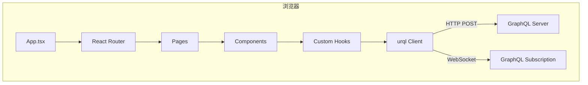
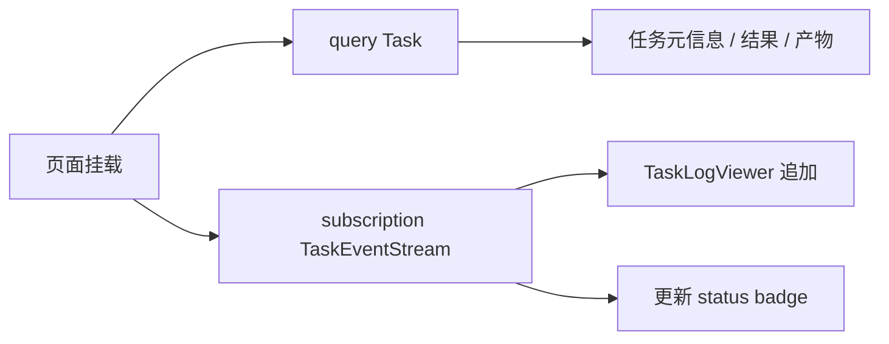

# 前端架构（Vite + TypeScript）

## 1. 概述

Web Dashboard 为 **Vite + React + TypeScript** SPA，通过 GraphQL 与后端交互，Subscription 实现任务日志与状态实时更新。

| 属性 | 选择 |
|------|------|
| 构建 | Vite 6 |
| 框架 | React 19 |
| 语言 | TypeScript 5（strict） |
| 路由 | React Router 7 |
| GraphQL | urql + @urql/exchange-graphcache |
| Subscription | graphql-ws + urql subscription exchange |
| 代码生成 | @graphql-codegen/cli |
| 样式 | Tailwind CSS 4 |
| 组件 | shadcn/ui（Radix 基础） |
| 状态 | urql cache + React Context（auth）；避免 Redux |
| 表单 | react-hook-form + zod |
| 表格 | TanStack Table |

## 2. 应用架构



## 3. 目录结构

```
web/
├── index.html
├── vite.config.ts
├── tsconfig.json
├── tsconfig.app.json
├── package.json
├── codegen.ts                      # graphql-codegen 配置
├── public/
└── src/
    ├── main.tsx                    # 入口：Provider 挂载
    ├── App.tsx                       # 路由定义
    ├── vite-env.d.ts
    │
    ├── graphql/
    │   ├── generated/                # codegen 输出（勿手改）
    │   │   ├── graphql.ts            # 类型
    │   │   └── introspection.json
    │   ├── operations/               # 手写 .graphql 文件
    │   │   ├── device.graphql
    │   │   ├── task.graphql
    │   │   └── subscription.graphql
    │   └── client.ts                 # urql Client 工厂
    │
    ├── pages/
    │   ├── Login.tsx
    │   ├── Dashboard.tsx             # 概览
    │   ├── devices/
    │   │   ├── DeviceList.tsx
    │   │   └── DeviceDetail.tsx
    │   └── tasks/
    │       ├── TaskList.tsx
    │       ├── TaskCreate.tsx
    │       └── TaskDetail.tsx        # 日志流 + 状态
    │
    ├── components/
    │   ├── layout/
    │   │   ├── AppShell.tsx
    │   │   ├── Sidebar.tsx
    │   │   └── Header.tsx
    │   ├── devices/
    │   │   ├── DeviceCard.tsx
    │   │   ├── DeviceStatusBadge.tsx
    │   │   └── CapabilityView.tsx
    │   ├── tasks/
    │   │   ├── TaskStatusBadge.tsx
    │   │   ├── TaskLogViewer.tsx     # 实时日志
    │   │   ├── TaskProgressBar.tsx
    │   │   └── ArtifactList.tsx
    │   └── ui/                       # shadcn 组件
    │
    ├── hooks/
    │   ├── useAuth.ts
    │   ├── useTaskSubscription.ts
    │   └── useDeviceSubscription.ts
    │
    ├── lib/
    │   ├── auth.ts                   # Token 存储
    │   └── utils.ts
    │
    └── types/
        └── index.ts                  # 业务辅助类型
```

## 4. 路由设计

| 路径 | 页面 | 说明 |
|------|------|------|
| `/login` | Login | API Key 或 OAuth（V1.1） |
| `/` | Dashboard | 设备/任务概览 |
| `/devices` | DeviceList | 设备列表 + 审批 |
| `/devices/:id` | DeviceDetail | 能力、负载、最近任务 |
| `/tasks` | TaskList | 任务列表 + 过滤 |
| `/tasks/new` | TaskCreate | 创建任务表单 |
| `/tasks/:id` | TaskDetail | 实时日志 + 结果 + 产物 |

## 5. GraphQL 客户端设计

### 5.1 urql Client 配置

```typescript
// 示意结构
const wsClient = createWSClient({
  url: `${WS_URL}/graphql`,
  connectionParams: () => ({ authorization: `Bearer ${getToken()}` }),
});

const client = createClient({
  url: `${API_URL}/graphql`,
  exchanges: [
    devtoolsExchange,
    cacheExchange,
    subscriptionExchange({ forwardSubscription: (op) => wsClient.subscribe(op) }),
    fetchExchange,
  ],
  fetchOptions: () => ({
    headers: { authorization: `Bearer ${getToken()}` },
  }),
});
```

### 5.2 代码生成

`codegen.ts` 从 `../api/graphql/schema.graphql` 生成：

- TypeScript 类型
- Typed Document Nodes（`operations/*.graphql`）

```bash
npm run codegen   # graphql-codegen --config codegen.ts
```

### 5.3 核心 Operations

| 文件 | 内容 |
|------|------|
| `device.graphql` | `Devices`, `Device`, `ApproveDevice`, `CreateRegistrationToken` |
| `task.graphql` | `Tasks`, `Task`, `CreateTask`, `CancelTask` |
| `subscription.graphql` | `TaskEventStream`, `TaskUpdated`, `DeviceStatusChanged` |

## 6. 页面设计要点

### 6.1 Dashboard

- 在线设备数 / 运行中任务数 / 今日成功失败比
- 最近任务列表（`tasks(first: 10)`）
- 待审批设备（`devices(approvalStatus: PENDING)`）

### 6.2 DeviceList

- 表格：name、status、labels、lastSeen、availableSlots
- 操作：approve / reject / revoke
- 「生成注册 Token」→ 展示一次性 token + 安装命令

```text
curl -fsSL ... | bash -s -- --token reg_xxx
# 或
builddock login --token reg_xxx --name my-pc
builddock start --daemon
```

### 6.3 TaskCreate

- 表单字段映射 `CreateTaskInput`
- Task type 切换动态显示 payload 编辑器（JSON editor 或分字段）
- Placement：device 选择 / labels 标签输入
- 提交 → 跳转 TaskDetail

### 6.4 TaskDetail（核心）



- **TaskLogViewer**：虚拟滚动（`@tanstack/react-virtual`），append-only
- 终态（SUCCEEDED/FAILED）后 unsubscribe
- 支持 cancel 按钮（`cancelTask` mutation）

## 7. 状态管理策略

| 数据 | 策略 |
|------|------|
| 服务端数据 | urql cache + refetch |
| 实时日志 | Subscription → 本地 useState（不写入 global cache） |
| 认证 Token | localStorage + AuthContext |
| UI 状态 | 组件 local state |

避免全局 store；实时日志体积大，不进 graphcache。

## 8. 认证（MVP）

MVP 使用 **API Key** 登录：

1. 用户输入 API Key
2. 存 localStorage
3. 调用 `query { viewer { orgId } }` 验证
4. 后续请求带 Bearer

V1.1：OAuth2 / OIDC 跳转。

## 9. 开发代理

`vite.config.ts`：

```typescript
server: {
  proxy: {
    '/graphql': { target: 'http://localhost:8080', ws: true },
  },
},
```

本地：`npm run dev` → `http://localhost:5173`，GraphQL 代理到 backend。

## 10. 构建与部署

| 模式 | 说明 |
|------|------|
| 开发 | Vite dev server + proxy |
| 生产 | `npm run build` → `dist/` |
| 托管 | Server 静态文件 middleware 或 Nginx/CDN |

生产环境 WebSocket 与 HTTP 同域，避免 CORS 复杂度。

## 11. UI 规范

- 深色/浅色主题（shadcn CSS variables）
- 状态色：queued=灰、running=蓝、succeeded=绿、failed=红
- 日志：stdout 默认色、stderr 红色、等宽字体
- 响应式：MVP 桌面优先；Mobile 后续独立 App 复用 GraphQL

## 12. 错误与加载

- urql `CombinedError` → Toast 通知（sonner）
- 页面级 Suspense + Skeleton
- GraphQL `errors[].extensions.code` 映射用户友好文案

## 13. MVP 页面优先级

| 优先级 | 页面 |
|--------|------|
| P0 | TaskDetail（日志流）、DeviceList、TaskCreate |
| P1 | TaskList、Dashboard |
| P2 | DeviceDetail、Login 美化 |
| V1.1 | Secrets 管理、Device Groups |

## 14. 实现顺序建议

1. Vite + React + Tailwind + shadcn 脚手架
2. graphql-codegen + urql client
3. Auth + AppShell + 路由
4. DeviceList + CreateRegistrationToken
5. TaskCreate + TaskList
6. TaskDetail + TaskEventStream Subscription
7. Dashboard 概览
