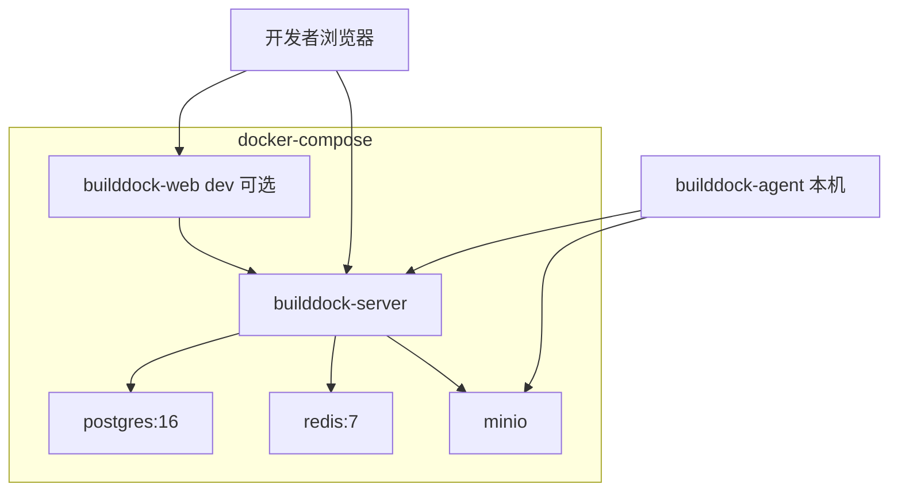
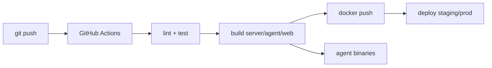

# 基础设施与部署

## 1. 部署拓扑

### 1.1 本地开发（Docker Compose）



### 1.2 生产（MVP 单机 / 小集群）

```
                    ┌─────────────┐
   Internet ───────►│   Nginx     │
                    │  TLS 终结   │
                    └──────┬──────┘
           ┌───────────────┼───────────────┐
           ▼               ▼               ▼
    /graphql (HTTP/WS)  /static (web)   /healthz
           │                               │
    ┌──────┴──────┐                 ┌──────┴──────┐
    │   Server    │                 │  PostgreSQL │
    │  (Go binary)│◄───────────────►│   Redis     │
    └──────┬──────┘                 │   MinIO     │
           │                         └─────────────┘
           ▼
    builddock-agent（用户设备，出站）
```

## 2. Docker Compose 服务定义（设计）

| 服务 | 镜像 | 端口 | 说明 |
|------|------|------|------|
| `postgres` | postgres:16-alpine | 5432 | 主数据库 |
| `redis` | redis:7-alpine | 6379 | EventBus + 限流 |
| `minio` | minio/minio | 9000, 9001 | S3 兼容存储 |
| `server` | builddock-server | 8080 | Go GraphQL |
| `web` | builddock-web 或 nginx | 5173 / 80 | 前端（生产为静态） |

`deploy/docker/docker-compose.yml` 包含 healthcheck 与 volume 持久化。

## 3. 数据存储

### 3.1 PostgreSQL

| 用途 | 说明 |
|------|------|
| 主存储 | devices、tasks、events、artifacts 元数据 |
| 任务队列 | `FOR UPDATE SKIP LOCKED`  dequeue |
| 迁移 | golang-migrate，启动前自动 migrate（可配置） |

**连接池**：pgx pool，max_conns 建议 20–50（按 CPU 核数）。

**备份**：pg_dump 日备；生产 WAL 归档（V1.1）。

### 3.2 Redis

| 用途 | MVP | 说明 |
|------|-----|------|
| EventBus Pub/Sub | ✅ | Subscription fan-out |
| 限流计数 | ✅ | API Key 速率 |
| 任务队列 | ❌ | MVP 用 PG 队列 |
| Session | V1.1 | OAuth session |

无 Redis 时：EventBus 降级为进程内 memory（仅单实例）。

### 3.3 对象存储（MinIO / S3）

| 路径 | 内容 |
|------|------|
| `artifacts/{org_id}/{task_id}/{name}` | 任务产物 |
| `logs/{org_id}/{task_id}/stdout.log` | 大日志归档（可选） |

预签名 URL 有效期：上传 15min，下载 1h。

## 4. 网络与安全

### 4.1 端口

| 端口 | 暴露 | 说明 |
|------|------|------|
| 443 | 公网 | Nginx HTTPS |
| 8080 | 内网 | Server（Nginx 反代） |
| 5432/6379/9000 | 内网 only | 数据层 |

Agent **仅需出站 443**，无需入站。

### 4.2 TLS

- 生产：Let's Encrypt 或云 LB 证书
- 本地：mkcert 或 HTTP（仅 dev）

WebSocket 与 HTTP 同域同端口（Nginx `Upgrade` 头）。

### 4.3 Nginx 配置要点

```nginx
# 示意
location /graphql {
    proxy_pass http://server:8080;
    proxy_http_version 1.1;
    proxy_set_header Upgrade $http_upgrade;
    proxy_set_header Connection "upgrade";
    proxy_read_timeout 3600s;   # pollTask 长轮询
}
```

`proxy_read_timeout` 需大于 `pollTask.timeoutMs`（如 60s+）。

## 5. Server 容器设计

`deploy/docker/Dockerfile.server`：

- 多阶段构建：`golang:1.22-alpine` → `distroless` 或 `alpine`
- 嵌入 migrations 或 init container 跑 migrate
- 非 root 用户运行
- 暴露 8080，健康检查 `/healthz`

环境变量见 [backend.md](./backend.md#9-配置项)。

## 6. Web 容器设计

生产两种模式：

| 模式 | 说明 |
|------|------|
| A. Server 托管静态 | `go:embed` 或挂载 `web/dist` 到 Server |
| B. 独立 Nginx | `Dockerfile.web` 仅 nginx + dist |

MVP 推荐 **模式 A**，减少组件。

## 7. Agent 分发

| 渠道 | 说明 |
|------|------|
| GitHub Releases | 各平台二进制 + checksum |
| Server 内置 | `GET /install.sh` 一键安装脚本 |
| 包管理 | Homebrew tap（V1.1） |

安装脚本流程：

```bash
1. 检测 OS/ARCH
2. 下载对应 builddock-agent 二进制
3. 写入 /usr/local/bin
4. builddock login --token $TOKEN
5. builddock remote-control start --daemon
5. 安装 systemd/launchd service（可选）
```

## 8. CI/CD 设计



| Job | 内容 |
|-----|------|
| `lint-go` | golangci-lint（backend + cli） |
| `test-go` | unit tests + race |
| `lint-web` | eslint + tsc |
| `codegen-check` | schema 变更后 codegen diff 为零 |
| `build-server` | docker build push |
| `build-agent` | matrix: darwin/linux/windows × amd64/arm64 |
| `build-web` | npm build artifact |

## 9. 环境划分

| 环境 | 用途 | 数据 |
|------|------|------|
| local | 开发者本机 compose | 可丢弃 |
| staging | 集成测试 | 脱敏 |
| production | 正式 | 备份 + HA |

## 10. 扩容路径

| 阶段 | 架构 |
|------|------|
| MVP | 单 Server + 单 PG + Redis + MinIO |
| V1.1 | Server 多副本 + Redis Pub/Sub（Subscription 跨实例） |
| V2 | 调度器独立 worker；PG 读副本；MinIO 分布式 |

多 Server 实例要点：

- Subscription 必须走 Redis Pub/Sub（非 memory EventBus）
- 任务队列仍用 PG SKIP LOCKED（天然分布式安全）
- `pollTask` 长轮询：任意实例可处理，Scheduler 写 PG 即可

## 11. 监控告警（V1.1）

| 指标 | 告警 |
|------|------|
| `http_requests_total{status=5xx}` | > 1% 5min |
| `tasks_queued_count` | > 100 持续 10min |
| `devices_offline_ratio` | > 50% |
| `poll_task_duration_seconds` | P99 > 60s |

## 12. Makefile 目标（设计）

```makefile
make dev          # compose up + migrate + run server + run web
make build        # server + agent + web
make test         # 全部测试
make codegen      # gqlgen + graphql-codegen
make migrate      # golang-migrate up
make lint         # golangci-lint + eslint
```

## 13. MVP 基础设施裁剪

| 组件 | MVP | V1.1 |
|------|-----|------|
| PostgreSQL | ✅ | HA |
| Redis | ✅ 单节点 | Sentinel |
| MinIO | ✅ 单节点 | 分布式 |
| Nginx TLS | ✅ | |
| K8s | — | Helm |
| OTel | — | ✅ |
