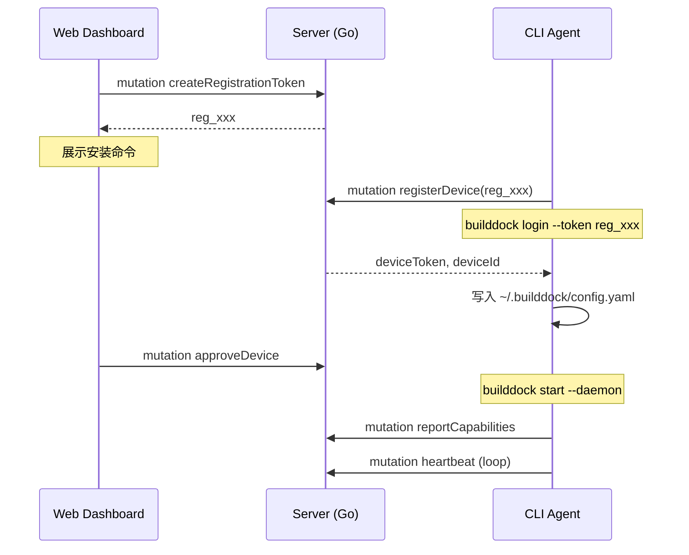
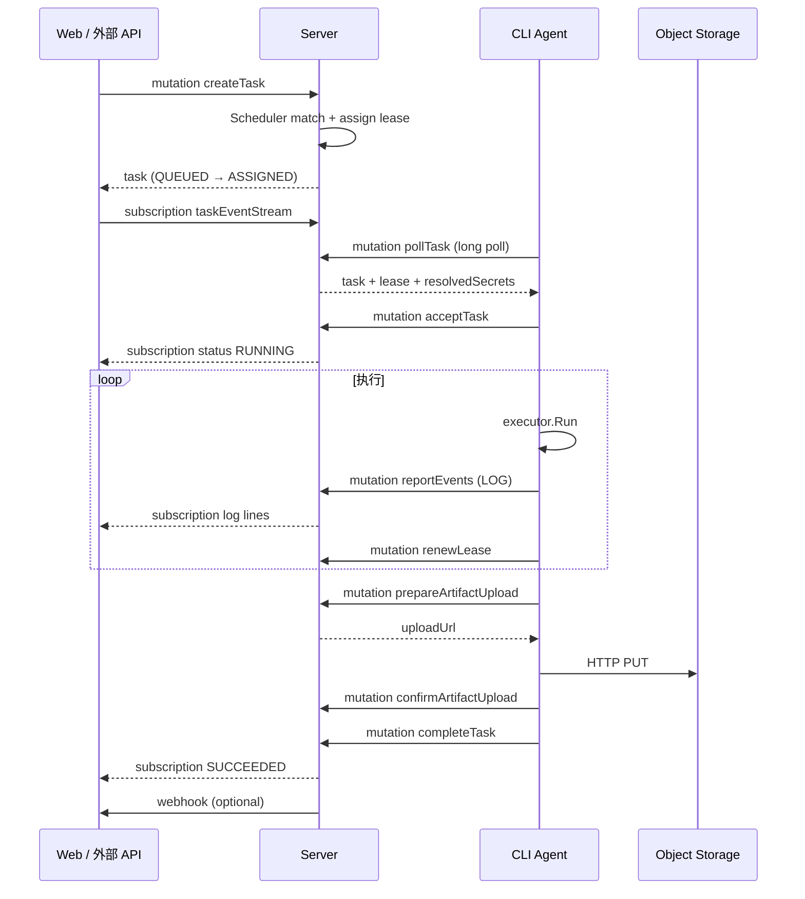

# 端到端集成

三端（Backend / CLI / Web）通过 **GraphQL Schema** 对齐，本文描述关键链路的跨组件协作。

## 1. 组件职责一览

| 组件 | 技术 | 部署位置 | 职责 |
|------|------|----------|------|
| Server | Go + gqlgen | 云端/自托管 | API、调度、存储、Subscription |
| builddock-agent | Go + cobra | 用户设备 | 执行任务、上报结果 |
| Web Dashboard | Vite + React + TS | 浏览器 | 管理、监控、触发任务 |

## 2. 设备注册链路



## 3. 任务执行链路



## 4. Schema 契约同步

```
docs/api/graphql-schema.graphql     ← 唯一真相源
         │
    ┌────┴────┬────────────┐
    ▼         ▼            ▼
 backend/   web/         cli/
 gqlgen    codegen      手写/生成
```

任何 API 变更流程：

1. 修改 `graphql-schema.graphql`
2. 更新 `docs/product/*.md` 示例
3. `make codegen`
4. 分别实现 resolver / UI / agent client

## 5. 共享概念映射

| 概念 | Domain (Go) | GraphQL | CLI | Web |
|------|-------------|---------|-----|-----|
| 设备状态 | `domain.DeviceStatus` | `DeviceStatus` enum | heartbeat input | `DeviceStatusBadge` |
| 任务状态 | `domain.TaskStatus` | `TaskStatus` enum | completeTask result | `TaskStatusBadge` |
| Task Spec | `domain.TaskSpec` | `JSON` / input types | executor 解析 | TaskCreate 表单 |
| Capability | `domain.CapabilityReport` | `ReportCapabilitiesInput` | probe 生成 | DeviceDetail 展示 |

Domain 层枚举与 GraphQL enum 值一致（SCREAMING_SNAKE_CASE）。

## 6. 认证流对照

| 调用方 | Token | 获取方式 | 存储 |
|--------|-------|----------|------|
| Web | API Key (MVP) | 用户粘贴 | localStorage |
| 外部系统 | API Key | 管理后台生成 | 密钥管理器 |
| Agent | Device Token | `builddock login` → registerDevice | ~/.builddock/config.yaml |
| 注册 | Registration Token | createRegistrationToken | 一次性 |

## 7. 失败场景跨组件行为

| 场景 | Server | Agent | Web |
|------|--------|-------|-----|
| Agent 离线 | lease 过期 → re-queue | 重连后 poll | 设备 OFFLINE badge |
| 任务超时 | scheduler → TIMED_OUT | kill 进程 | 终态展示 |
| 用户 cancel | cancelRequested=true | 下次感知 → kill | Cancel 按钮 |
| poll 长轮询断连 | 无影响 | 立即重 poll | — |
| Subscription 断连 | — | — | urql 自动重连 |

## 8. 本地联调清单

```
□ docker compose up（PG + Redis + MinIO）
□ make migrate && make run-server
□ npm run dev（web）
□ builddock login --token <reg_xxx>
□ Web 审批设备
□ builddock start --daemon
□ builddock status --refresh
□ Web 创建 shell 任务 → TaskDetail 看日志
□ 验证产物上传与 complete
```

## 9. 相关文档

- [Monorepo 结构](./monorepo.md)
- [后端架构](./backend.md)
- [CLI 命令设计](./cli-commands.md)
- [前端架构](./frontend.md)
- [基础设施](./infrastructure.md)
- [GraphQL API 概览](../product/api-overview.md)
