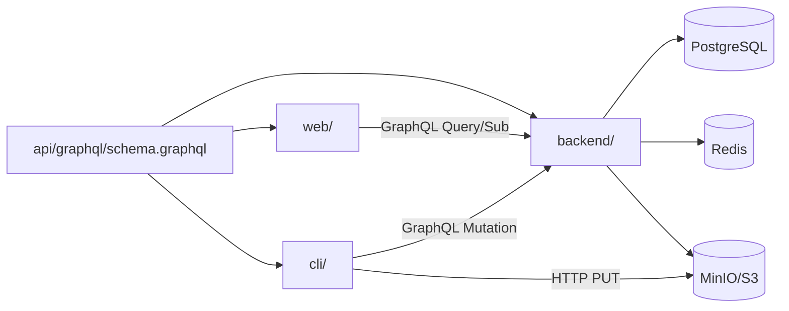

# Monorepo 结构

## 1. 设计原则

| 原则 | 说明 |
|------|------|
| 单一仓库 | 后端、CLI、前端、Schema 同仓，版本一致 |
| 共享契约 | GraphQL Schema 为 API 唯一来源；Go 类型由 gqlgen 生成 |
| 独立部署 | `server`、`builddock-agent`、`web` 各自构建、独立发布 |
| 最小共享库 | Go 侧仅共享 `pkg/` 中的纯类型与工具，避免业务耦合 |

## 2. 目录结构

```
BuildDock/
├── docs/                          # 产品与架构文档
│   ├── api/
│   │   └── graphql-schema.graphql
│   ├── architecture/              # 本目录
│   └── product/
│
├── api/                           # API 契约（构建输入）
│   └── graphql/
│       └── schema.graphql         # 从 docs/api 同步或 symlink
│
├── backend/                       # Go 后端
│   ├── cmd/
│   │   └── server/
│   │       └── main.go
│   ├── internal/
│   │   ├── config/
│   │   ├── domain/                # 领域模型（纯 Go，无框架依赖）
│   │   ├── repository/            # 持久化
│   │   ├── service/               # 业务逻辑
│   │   ├── scheduler/             # 任务调度
│   │   ├── graphql/               # gqlgen 生成 + resolver
│   │   ├── auth/
│   │   ├── webhook/
│   │   └── storage/               # 对象存储客户端
│   ├── migrations/
│   ├── gqlgen.yml
│   └── go.mod
│
├── cli/                           # Go CLI Agent
│   ├── cmd/
│   │   └── builddock-agent/
│   │       └── main.go
│   ├── internal/
│   │   ├── config/
│   │   ├── client/                # GraphQL HTTP 客户端
│   │   ├── agent/                 # 主循环：heartbeat + poll
│   │   ├── executor/              # shell / script 执行器
│   │   ├── artifact/              # 产物收集与上传
│   │   └── fingerprint/           # 机器指纹
│   └── go.mod
│
├── web/                           # Vite + TypeScript 前端
│   ├── src/
│   │   ├── main.tsx
│   │   ├── App.tsx
│   │   ├── graphql/               # 生成的类型 + 手写 operations
│   │   ├── pages/
│   │   ├── components/
│   │   ├── hooks/
│   │   └── lib/
│   ├── index.html
│   ├── vite.config.ts
│   ├── tsconfig.json
│   └── package.json
│
├── deploy/                        # 部署配置
│   ├── docker/
│   │   ├── Dockerfile.server
│   │   ├── Dockerfile.web
│   │   └── docker-compose.yml
│   └── k8s/                       # V2
│
├── scripts/
│   ├── codegen.sh                 # gqlgen + graphql-codegen
│   └── migrate.sh
│
├── Makefile                       # 统一构建入口
└── README.md
```

## 3. 模块依赖关系



| 模块 | 依赖 | 不依赖 |
|------|------|--------|
| `backend` | PostgreSQL、Redis（可选）、S3 | `cli`、`web` |
| `cli` | `backend` GraphQL API、S3 | `web` |
| `web` | `backend` GraphQL API | `cli` |

**CLI 与 Backend 不共享 Go module**：CLI 通过 GraphQL 契约解耦，避免循环依赖。可选后续提取 `pkg/builddock` 共享 JSON 类型。

## 4. 代码生成流水线

```
docs/api/graphql-schema.graphql
        │
        ├──► backend: gqlgen generate
        │         → internal/graphql/generated/
        │         → internal/graphql/resolver/
        │
        ├──► web: graphql-codegen
        │         → src/graphql/generated.ts
        │         → src/graphql/operations/
        │
        └──► cli: 手写 GraphQL 字符串 或 轻量 codegen（可选）
```

`make codegen` 统一触发：

1. 校验 Schema 语法
2. `cd backend && go generate ./...`
3. `cd web && npm run codegen`

## 5. 构建产物

| 产物 | 命令 | 输出 |
|------|------|------|
| Server | `make build-server` | `bin/server` |
| Agent | `make build-agent` | `bin/builddock-agent` |
| Web | `make build-web` | `web/dist/` |

Agent 需交叉编译：

```
GOOS=darwin  GOARCH=arm64  → builddock-agent-darwin-arm64
GOOS=linux   GOARCH=amd64  → builddock-agent-linux-amd64
GOOS=windows GOARCH=amd64  → builddock-agent-windows-amd64.exe
```

Server 发布为 Docker 镜像；Web 静态资源由 Server 托管或 CDN。

## 6. 版本策略

| 对象 | 版本来源 |
|------|----------|
| API Schema | `schema_version: "1.0"` 字段 + git tag |
| Server | `backend/internal/version` + git tag |
| Agent | 嵌入 `cli/internal/version`，与 Server 兼容矩阵文档化 |
| Web | `package.json` version，构建时注入 |

Agent 启动时可校验 Server 版本，不兼容时警告（不强制阻断 MVP）。

## 7. 本地开发启动顺序

```
1. docker compose up -d postgres redis minio
2. make migrate
3. make run-server          # :8080/graphql
4. make run-web             # :5173，proxy → :8080
5. builddock login + remote-control start
```

## 8. MVP 裁剪

| 目录/模块 | MVP | V2 |
|-----------|-----|-----|
| `backend/internal/scheduler` | 单进程内调度 | 独立 worker 进程 |
| `backend/internal/webhook` | 基础 HMAC | 重试 + dead letter |
| `cli/internal/executor` | shell, script | docker, plugin |
| `web/src/pages` | devices, tasks, task-detail | settings, secrets |
| `deploy/k8s` | — | Helm chart |
