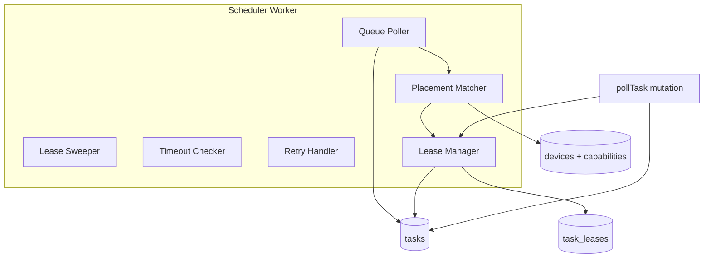

# 调度器设计

Schema Version: `1.0`

## 1. 职责

调度器（Scheduler）负责：

1. 从队列取出 `QUEUED` 任务
2. 根据 Placement 匹配在线设备
3. 分配 Lease
4. 处理超时、重试、取消、设备离线

MVP 作为 **Server 进程内后台 Worker**（goroutine），V2 可拆独立进程。

## 2. 架构



## 3. 后台任务

| 循环 | 间隔 | 动作 |
|------|------|------|
| Queue Poller | 1s | Claim QUEUED → Match → Assign |
| Lease Sweeper | 5s | ASSIGNED 且 lease 过期 → re-queue |
| Running Timeout | 5s | RUNNING 超 spec.timeout → TIMED_OUT |
| Deadline Checker | 10s | QUEUED 且 deadline 过 → EXPIRED |
| Device Offline | 30s | 心跳超时 → device OFFLINE + 释放 assigned |
| Retry | 事件驱动 | FAILED 且 attempt < max → re-queue |

## 4. Placement Matcher

### 4.1 输入输出

```go
type MatchInput struct {
    Task      *domain.Task
    Devices   []*domain.DeviceWithCapability
}

type MatchResult struct {
    Device *domain.Device
    Score  float64
}
```

### 4.2 硬过滤（任一不满足则排除）

```
device.status == ONLINE
device.approval_status == APPROVED
device.available_slots > 0
placement.device_id 匹配（若指定）
required_labels 全部满足
required_handlers 包含 task.spec.type
required_runtimes 版本满足（semver）
resource_requirements 满足
trust_level == UNTRUSTED → device.constraints.allow_untrusted
```

### 4.3 软打分（capability_score / least_loaded）

```
score = 0
score += preferred_labels 命中数 × 10
score -= device.load.cpu_usage × 5
score -= device.load.memory_usage × 3
score -= device.active_tasks × 2
score += sticky_bonus（同 device 最近执行过同 idempotency_key）
```

`strategy=least_loaded`：选 `active_tasks` 最小；平局按 score。

### 4.4 标签匹配

```go
func labelsMatch(device, required map[string]string) bool {
    for k, v := range required {
        if device[k] != v { return false }
    }
    return true
}
```

## 5. Lease Manager

### 5.1 分配

```
GrantLease(task, device):
  1. lease_id = new ULID
  2. expires_at = now + 5min（可配置）
  3. INSERT task_leases
  4. UPDATE tasks SET ASSIGNED, lease_*, assigned_device_id
  5. device.available_slots -= 1
```

### 5.2 续租

```
RenewLease(task, lease_id, generation):
  IF task.lease_id != lease_id OR device.generation != generation
    → CONFLICT
  ELSE
    expires_at = now + 5min
    UPDATE task_leases.renewed_at
```

### 5.3 释放

| 原因 | 动作 |
|------|------|
| completeTask | release lease, device.slots += 1 |
| lease 过期 | re-queue task, release lease |
| cancel | cancel task, release if assigned |
| device offline | re-queue assigned 未 running 的任务 |

### 5.4 Fencing

`pollTask` 返回任务时携带 `lease.generation = device.generation`。

续租/complete 时校验 generation 一致，防止设备重启后旧 lease 误用。

## 6. pollTask 与 Scheduler 协作

两种方式（MVP 选 B）：

**A. 被动等待**：Scheduler assign 后，pollTask 查 ASSIGNED 任务返回。

**B. 主动触发（推荐）**：

```
pollTask(deviceID):
  1. 先查该 device 是否已有 ASSIGNED 任务 → 有则立即返回
  2. 否则 loop until timeout:
       a. Matcher.TryAssignForDevice(deviceID)  // 从 QUEUED 找匹配任务
       b. 找到 → return
       c. sleep 500ms
```

Scheduler Queue Poller 与 pollTask 可并发，靠 PG `SKIP LOCKED` + 事务保证互斥。

## 7. 状态转换（Scheduler 触发）

| 从 | 到 | 触发 |
|----|-----|------|
| QUEUED | ASSIGNING | ClaimQueuedTask |
| ASSIGNING | ASSIGNED | GrantLease 成功 |
| ASSIGNING | QUEUED | 无匹配设备，回退 |
| ASSIGNED | RUNNING | acceptTask |
| RUNNING | SUCCEEDED/FAILED | completeTask |
| RUNNING | TIMED_OUT | Timeout Checker |
| ASSIGNED | QUEUED | Lease 过期 |
| * | CANCELLED | cancelTask |
| QUEUED | EXPIRED | deadline 过 |

## 8. 重试策略

```
completeTask status=FAILED
  IF attempt < spec.retry.max_attempts
    → attempt += 1
    → runtime_status = QUEUED
    → 清除 assigned/lease/result
    → sleep spec.retry.backoff_sec（Scheduler 侧）
  ELSE
    → 保持 FAILED
```

非零 exit code 触发 FAILED；panic/executor 错误同理。

## 9. 并发与锁

| 场景 | 机制 |
|------|------|
| 多 Scheduler 实例（V1.1） | `FOR UPDATE SKIP LOCKED` |
| 单任务单设备 | lease_id 唯一有效 |
| Matcher 读 devices | 只读，最终一致可接受 |

## 10. 指标

| 指标 | 类型 |
|------|------|
| `scheduler_tasks_queued` | Gauge |
| `scheduler_match_duration_seconds` | Histogram |
| `scheduler_assign_total` | Counter |
| `scheduler_requeue_total` | Counter by reason |

## 11. MVP 裁剪

| 能力 | MVP | V1.1 |
|------|-----|------|
| capability_match | ✅ 基础 | preferred_labels 打分 |
| sticky strategy | ❌ | ✅ |
| 独立 scheduler 进程 | ❌ | ✅ |
| 优先级队列 | ❌ | ✅ |

## 12. 实现包

```
backend/internal/scheduler/
├── worker.go           # 后台循环入口
├── matcher.go          # Placement 匹配
├── lease_manager.go
├── queue.go            # sqlc 封装
├── timeout.go
└── retry.go
```

Worker 在 `cmd/server/main.go` 中 `go scheduler.Start(ctx)` 启动。
