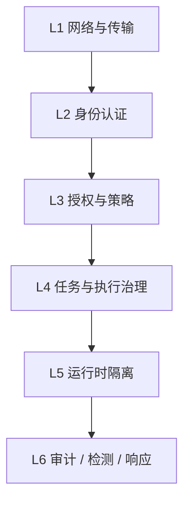
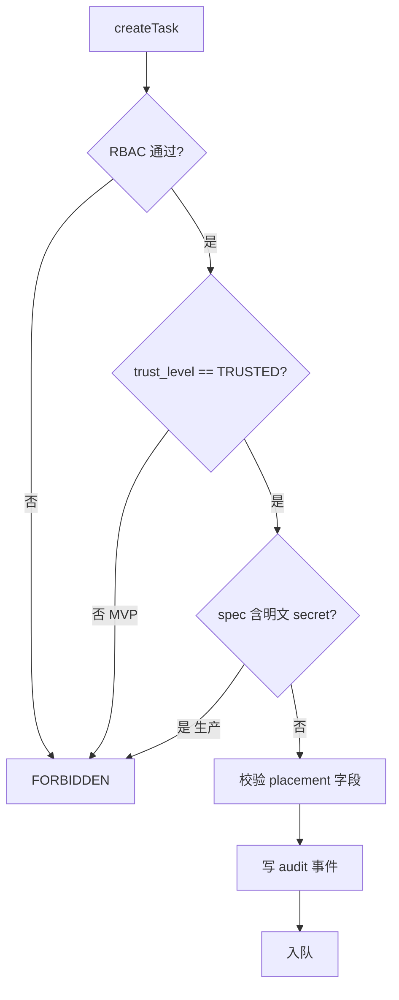

# 安全架构

Schema Version: `1.0`

本文描述 BuildDock **必须接入**的安全措施在各组件中的落地方式。产品侧目标与分阶段清单见 [安全要求](../product/security.md)。

> 认证、Token 与 RBAC 矩阵详见 [认证与授权](./auth.md)，本文不重复 Token 格式细节。

## 1. 概述

BuildDock 采用**纵深防御**：任一层失效时，仍有一层可阻断或缩小影响范围。



| 层级 | 职责 | MVP | V1.1 | V2 |
|------|------|-----|------|-----|
| L1 | TLS、出站-only | ✅ | mTLS（Enterprise） | 私有部署 |
| L2 | Token 分轨、哈希存储 | ✅ | scope、轮换、OAuth | 设备签名 |
| L3 | org 隔离、RBAC、labels | ✅ | Policy 引擎 | 细粒度 RBAC |
| L4 | trust_level、审批、Placement | ✅ | 任务审批流 | UNTRUSTED |
| L5 | working_dir、env 最小化 | ✅ | denylist | sandbox |
| L6 | audit slog、rate limit | ✅ | audit_logs、告警 | SIEM |

## 2. 威胁模型

### 2.1 核心资产

| 资产 | 存储 / 传输 | 泄露后果 |
|------|-------------|----------|
| API Key | Web / CI / DB 哈希 | 创建任务、管理设备 |
| Device Token | `~/.builddock/config.yaml` | 领任务、获取 resolvedSecrets |
| Registration Token | 一次性链接 | 注册新设备进 org |
| 任务 Secrets | secrets 表 / 执行期内存 | 第三方服务凭证泄露 |
| 用户机器 | Agent 执行环境 | 源码、SSH、内网 |

### 2.2 攻击路径（设计须覆盖）

| ID | 场景 | MVP 缓解 | 后续增强 |
|----|------|----------|----------|
| A1 | API Key 泄露 | RBAC、rate limit、吊销 | scoped Key、IP allowlist |
| A2 | Device Token 泄露 | device 绑定、revoke、0600 | Token 轮换、请求签名 |
| A3 | 恶意设备注册 | 一次性 reg、**默认 PENDING** | reg 绑定预期 labels |
| A4 | 任务派错设备 | `required_labels`、`device_ids` | Policy 引擎 |
| A5 | 恶意 task spec | TRUSTED only、working_dir | sandbox、allowlist |
| A6 | pollTask 越权 | assigned_device 校验、lease | fencing 告警 |
| A7 | 日志 / 产物泄密 | 短 TTL 预签名、鉴权下载 | DLP |
| A8 | GraphQL 滥用 | rate limit、复杂度限制 | 关 introspection |

## 3. 控制面（Backend）

### 3.1 认证与授权（MVP）

与 [auth.md](./auth.md) 一致，实现层**强制**：

- Middleware 解析 Token → `Subject` → RBAC `Enforce(operation)`
- 所有 Repository 查询带 `org_id` 谓词（sqlc 层校验）
- Device Token：`deviceId` 必须匹配；`acceptTask` / `completeTask` 须 `assigned_device_id` 一致

### 3.2 设备审批（MVP）

```
registerDevice → approval_status = PENDING
Scheduler.assign → 跳过 approval_status != APPROVED 的设备
approveDevice → APPROVED → 可分配任务
revokeDevice → REVOKED → 清 token_hash，断开后续 poll
```

配置项（组织级）：

| 字段 | 默认 | 说明 |
|------|------|------|
| `require_device_approval` | `true` | `false` 时注册即 APPROVED（仅 dev） |

### 3.3 任务创建策略（MVP）

`TaskService.Create` 校验链：



- MVP 拒绝 `trustLevel != TRUSTED`
- 生产环境拒绝 spec 内明文 password / token 字段（仅 `secretRefs`）
- `placement.required_labels` 必须与目标设备 capabilities 匹配（Scheduler）

### 3.4 Secrets 生命周期（MVP → V1.1）

| 阶段 | 行为 |
|------|------|
| createTask | 仅存 `secretRefs`，不解析明文 |
| assign / pollTask | TaskService 解析 ref → `resolvedSecrets`（仅写入 poll 响应） |
| Agent 执行 | 注入 env，不写入日志 |
| completeTask | 服务端与 Agent 内存清零；不持久化 resolvedSecrets |
| V1.1 | secrets 表 AES-GCM + KMS；audit `secret.resolved` |

### 3.5 Rate Limit（MVP）

见 [auth.md §8](./auth.md#8-限流)。额外建议：

| 操作 | 限制 |
|------|------|
| `createRegistrationToken` | 10/min per org |
| `registerDevice` | 20/min per IP |
| `createTask` | 100/min per API Key |

### 3.6 GraphQL 加固（V1.1）

| 项 | 措施 |
|----|------|
| 深度 / 复杂度 | gqlgen 中间件上限 |
| Introspection | 生产关闭 |
| 错误响应 | 不返回 SQL / stack |

### 3.7 Policy 引擎（V1.1）

内置规则（可扩展为 OPA）：

```yaml
# 示意
- effect: DENY
  when:
    task.trustLevel: UNTRUSTED
  reason: MVP 不支持

- effect: DENY
  when:
    device.labels.tier: personal
    task.secretRefs: present
  reason: 个人设备禁止含 secret 任务

- effect: REQUIRE_APPROVAL
  when:
    task.spec.type: shell
    task.secretRefs: present
```

### 3.8 任务审批状态（V1.1）

```
createTask → PENDING_APPROVAL（Policy 命中）
approveTask → QUEUED → 正常调度
rejectTask → REJECTED
```

## 4. 执行面（CLI Agent）

### 4.1 本地凭据（MVP）

| 项 | 措施 |
|----|------|
| `config.yaml` | 权限 `0600` |
| Token | 不写入环境变量、不 slog 输出 |
| V1.1 | 可选 OS keyring 存储 `device_token` |

### 4.2 任务接受前校验（MVP）

Agent `TaskRunner` 在 `acceptTask` 前：

1. `trustLevel == UNTRUSTED` → 拒绝，`completeTask(FAILED, reason=UNTRUSTED_REJECTED)`
2. `approval_status != APPROVED` → 不应收到任务；若收到则拒绝并上报
3. 解析 working_dir：必须在 `{base}/workspaces/{task_id}` 下创建，禁止 `..`

### 4.3 Executor 隔离（MVP）

| 项 | 措施 |
|----|------|
| working_dir | 默认 `~/.builddock/workspaces/{task_id}` |
| 路径穿越 | 规范化路径 + prefix 检查 |
| 环境变量 | 默认不继承用户 shell；仅 `spec.env` + `resolvedSecrets` |
| 超时 | `spec.timeout` → `context.WithTimeout` → kill 进程树 |
| 命令执行 | `exec.CommandContext` + 参数分离，禁止字符串拼接 shell |
| 敏感路径 | V1.1 denylist：`~/.ssh`、`~/.aws` 等不可作 cwd |

### 4.4 Sandbox（V2）

| 平台 | 方案 |
|------|------|
| Linux | bubblewrap / nsjail profile |
| macOS | Docker / Podman 容器 |
| 触发条件 | `trustLevel == UNTRUSTED` 或 Policy 要求 |

### 4.5 设备约束（capabilities.constraints）

与 [device-capability.md](../product/device-capability.md) 对齐：

```json
{
  "max_concurrent_tasks": 3,
  "allow_untrusted_tasks": false
}
```

MVP `allow_untrusted_tasks` 默认 `false`。

## 5. Web Dashboard

### 5.1 MVP

| 项 | 措施 |
|----|------|
| 设备审批 | `approveDevice` / `rejectDevice` UI |
| API Key | 仅 dev；`localStorage` 存 Key 须文档警告 |
| 风险披露 | 添加设备页展示 Agent 风险说明 |
| CSP | 建议 baseline（V1.1 强制） |

### 5.2 V1.1

| 项 | 措施 |
|----|------|
| 认证 | OAuth2 + PKCE → HttpOnly Session Cookie |
| API Key 管理 | 创建 / 吊销 / scope / 过期 |
| 审计 | audit_logs 查询页 |
| 任务审批 | PENDING_APPROVAL 任务 Approve / Reject |

## 6. 基础设施

见 [infrastructure.md §4](./infrastructure.md#4-网络与安全)。MVP 补充：

| 项 | 措施 |
|----|------|
| TLS | 生产强制；Agent 仅出站 443 |
| 对象存储 | bucket 禁止 public；按 org 前缀隔离 |
| 预签名 URL | 上传 15min、下载 1h；绑定 task 归属 |
| DB / Redis | 内网 only；最小权限账号 |
| 容器 | 非 root 运行 Server |

## 7. 审计与检测

### 7.1 MVP 审计事件（结构化 slog）

| 事件 | 字段 |
|------|------|
| `device.registered` | org_id, device_id, machine_id, ip |
| `device.approved` / `device.rejected` / `device.revoked` | actor, device_id |
| `api_key.created` / `api_key.revoked` | key_prefix, actor |
| `task.created` | task_id, org_id, trust_level, spec_hash, actor |
| `task.cancelled` | task_id, actor |
| `task.completed` | task_id, device_id, status, exit_code |
| `auth.denied` | operation, subject_type, reason |

禁止记录：完整 Token、resolvedSecrets 明文。

### 7.2 V1.1 audit_logs 表

持久化上述事件，支持 Dashboard 查询与导出。

### 7.3 检测规则（V1.1+）

| 信号 | 动作 |
|------|------|
| createTask > 50/min 单 Key | 限流 + 告警 |
| 新设备注册后立即含 secret 任务 | 冻结 + 需 admin |
| 双 accept 同一 lease | fencing + 告警 |

## 8. Webhook 安全（V1.1）

```
签名: HMAC-SHA256(webhook_secret, timestamp + "." + body)
Header: X-BuildDock-Signature, X-BuildDock-Timestamp
校验: |now - timestamp| < 300s；nonce 防重放（Redis）
```

## 9. 实现位置

```
backend/internal/
├── auth/              # 已有：middleware, rbac
├── policy/            # V1.1：规则引擎
├── audit/             # MVP：slog emitter；V1.1：audit_logs repo
├── service/
│   ├── task_service.go    # create 校验链、secrets 解析
│   └── device_service.go  # 审批、revoke、rotate
└── scheduler/         # 跳过未 APPROVED 设备

cli/internal/
├── config/            # 0600
├── agent/task_runner.go   # trust / working_dir 校验
├── executor/          # 隔离执行
└── security/          # V1.1：denylist、V2：sandbox wrapper

web/src/
├── pages/devices/     # 审批 UI
└── pages/settings/    # Key 管理（V1.1）
```

## 10. 事件响应（运维）

| 事件 | 动作 |
|------|------|
| API Key 泄露 | 吊销 → 查 audit → 取消进行中任务 |
| Device Token 泄露 | revokeDevice → 用户 re-register → 查历史任务 |
| 可疑任务 | cancelTask → draining 设备 → 导出 audit |
| 平台入侵怀疑 | 暂停 createTask → 强制 Token 轮换 → 客户通知 |

## 11. 相关文档

| 文档 | 说明 |
|------|------|
| [安全要求](../product/security.md) | 产品目标、分阶段清单、默认值 |
| [认证与授权](./auth.md) | Token、RBAC |
| [调度器设计](./scheduler.md) | Placement、Lease |
| [CLI 架构 — 安全](./cli.md#10-安全) | Agent 本地措施 |
| [Task Schema](../product/task-schema.md) | trust_level、placement |
| [端到端集成](./integration.md) | 联调与安全检查项 |
