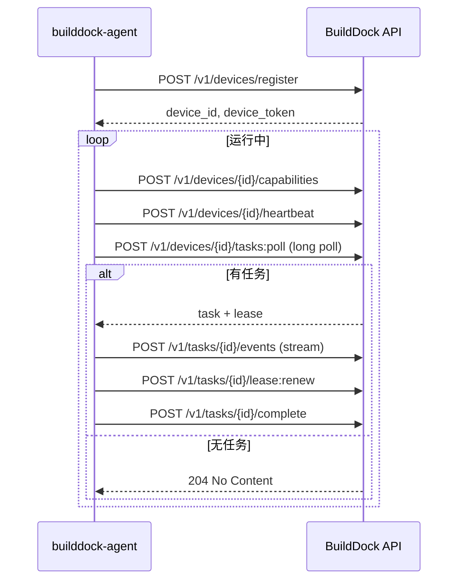

# Agent 协议

Schema Version: `1.0`

CLI Agent（`builddock-agent`）与平台之间的交互协议。

## 1. 设计原则

| 原则 | 说明 |
|------|------|
| 出站优先 | Agent 主动连平台，无需开入站端口 |
| 长轮询领任务 | MVP 使用 HTTP 长轮询，简单可靠 |
| Lease 防重复 | 任务分配带 lease，过期可 re-queue |
| 流式上报 | 日志逐行上报，支持实时追踪 |
| 幂等完成 | complete 请求带 lease_id，防重复提交 |

## 2. 认证

所有 Agent API 使用 Device Token：

```http
Authorization: Bearer dtok_xxx
```

Token 在 [设备注册](./device-capability.md#3-设备注册) 时获取。

## 3. Agent 生命周期



## 4. CLI 命令

```bash
# 注册设备（使用 registration token）
builddock-agent register --token reg_xxx --name "my-macbook"

# 启动 Agent 守护进程
builddock-agent start

# 查看本地状态
builddock-agent status

# 停止
builddock-agent stop
```

### 4.1 register

1. 采集本机 fingerprint
2. 探测 handlers、runtimes
3. 调用 `POST /v1/devices/register`
4. 将 `device_token` 写入本地配置（`~/.builddock/config.yaml`）

### 4.2 start

1. 加载本地配置
2. 上报完整 Capability Report
3. 启动 heartbeat goroutine
4. 进入 poll loop

## 5. API 交互详情

### 5.1 上报 Capability

```http
POST /v1/devices/{device_id}/capabilities
Authorization: Bearer dtok_xxx
Content-Type: application/json
```

Body：[Capability Report](./device-capability.md#4-capability-report)

响应：`204 No Content`

### 5.2 心跳

```http
POST /v1/devices/{device_id}/heartbeat
Authorization: Bearer dtok_xxx
```

Body：见 [心跳](./device-capability.md#5-心跳轻量-capability)

响应：

```json
{
  "poll_interval_ms": 3000,
  "heartbeat_interval_ms": 30000
}
```

平台可在响应中动态调整间隔。

### 5.3 领取任务（长轮询）

```http
POST /v1/devices/{device_id}/tasks:poll
Authorization: Bearer dtok_xxx
Content-Type: application/json
```

请求：

```json
{
  "generation": 43,
  "available_slots": 1,
  "supported_types": ["shell", "script"]
}
```

| 字段 | 说明 |
|------|------|
| `generation` | 当前设备 generation |
| `available_slots` | 可接收的新任务数 |
| `supported_types` | 当前可用的 task type |

响应（有任务，200）：

```json
{
  "task": {
    "id": "task_01JXYZ...",
    "lease": {
      "lease_id": "lease_xxx",
      "expires_at": "2026-07-30T15:10:00Z"
    },
    "spec": {},
    "resolved_secrets": {
      "NPM_TOKEN": "secret-value"
    }
  }
}
```

响应（无任务，204）：Agent 等待 `poll_interval_ms` 后重试。

长轮询超时建议：30–60 秒。

### 5.4 接受任务

Agent 收到任务后，应调用 accept（将 status 从 assigned → running）：

```http
POST /v1/tasks/{task_id}/accept
Authorization: Bearer dtok_xxx
```

```json
{
  "lease_id": "lease_xxx",
  "generation": 43
}
```

响应：`204 No Content`

若 lease 无效或 generation 不匹配，返回 `409 Conflict`。

### 5.5 续租

长任务执行期间定期续租（建议每 30 秒或 lease 过期前 50%）：

```http
POST /v1/tasks/{task_id}/lease:renew
Authorization: Bearer dtok_xxx
```

```json
{
  "lease_id": "lease_xxx",
  "generation": 43
}
```

响应：

```json
{
  "lease_id": "lease_xxx",
  "expires_at": "2026-07-30T15:15:00Z"
}
```

### 5.6 上报事件

```http
POST /v1/tasks/{task_id}/events
Authorization: Bearer dtok_xxx
Content-Type: application/json
```

单条：

```json
{
  "type": "log",
  "data": {
    "stream": "stdout",
    "line": "PASS src/utils.test.ts"
  }
}
```

批量（可选优化）：

```json
{
  "events": [
    { "type": "log", "data": { "stream": "stdout", "line": "..." } },
    { "type": "progress", "data": { "percent": 50, "message": "Testing..." } }
  ]
}
```

### 5.7 上传产物

大文件走 multipart 或预签名 URL：

```http
POST /v1/tasks/{task_id}/artifacts
Authorization: Bearer dtok_xxx
Content-Type: multipart/form-data
```

或使用预签名 URL 流程：

```http
POST /v1/tasks/{task_id}/artifacts:prepare
```

```json
{
  "name": "coverage",
  "size_bytes": 1048576,
  "content_type": "application/gzip"
}
```

响应：

```json
{
  "upload_url": "https://storage.example.com/...",
  "artifact_id": "art_xxx"
}
```

Agent PUT 文件到 `upload_url`，再调用 confirm。

### 5.8 提交结果

```http
POST /v1/tasks/{task_id}/complete
Authorization: Bearer dtok_xxx
Content-Type: application/json
```

```json
{
  "lease_id": "lease_xxx",
  "result": {
    "status": "succeeded",
    "exit_code": 0,
    "started_at": "2026-07-30T15:00:05Z",
    "finished_at": "2026-07-30T15:04:32Z",
    "duration_ms": 267000,
    "output": {
      "stdout_ref": "log://task_01JXYZ/stdout",
      "stderr_ref": "log://task_01JXYZ/stderr"
    },
    "artifacts": [
      { "name": "coverage", "artifact_id": "art_xxx" }
    ]
  }
}
```

响应：`204 No Content`

重复 complete 返回 `409 Conflict`（幂等保护）。

## 6. Executor 接口（Agent 内部）

Agent 内部按 task type 分发到 executor：

```go
type Executor interface {
    Type() string
    Execute(ctx context.Context, spec TaskSpec, env ExecEnv) (*ExecResult, error)
}

type ExecEnv struct {
    WorkingDir string
    Env        map[string]string
    Secrets    map[string]string
    EventSink  EventSink
}

type EventSink interface {
    Log(stream string, line string)
    Progress(percent int, message string)
}

type ExecResult struct {
    ExitCode   int
    Structured map[string]any  // 可选结构化输出
}
```

### 6.1 MVP Executors

| Executor | 说明 |
|----------|------|
| `ShellExecutor` | 执行 `payload.command` |
| `ScriptExecutor` | 写入临时脚本文件后执行 |

### 6.2 执行流程

```
1. 解析 spec.type → 选择 Executor
2. 创建工作目录（若 spec.working_dir 不存在则报错或使用默认）
3. 注入 env + secrets
4. 启动进程，stdout/stderr 逐行 → EventSink.Log
5. 等待进程结束或 ctx 超时
6. 收集 artifacts（glob match spec.artifacts.collect）
7. 上传 artifacts
8. 构造 TaskResult 并 complete
```

## 7. 错误处理

| 场景 | Agent 行为 |
|------|-----------|
| 网络中断 | 本地缓冲日志，重连后继续上报；lease 过期则停止执行 |
| 执行超时 | kill 进程，complete with status=failed, code=TIMED_OUT |
| 平台 cancel | poll 或 event 收到 cancel → kill 进程，complete with cancelled |
| lease 续租失败 | 停止执行，不上报 complete（平台会 re-queue） |
| 进程非零退出 | complete with status=failed, exit_code=N |

## 8. 本地配置

`~/.builddock/config.yaml`：

```yaml
hub_url: https://api.builddock.example.com
device_id: dev_01JABC...
device_token: dtok_xxx
name: macbook-pro-m3
working_dir: /tmp/builddock
max_concurrent_tasks: 3
log_level: info
```

## 9. 安全

| 措施 | 说明 |
|------|------|
| Token 存储 | 本地文件权限 0600 |
| Secrets | 仅在任务执行期间存在于内存，完成后清零 |
| 命令执行 | MVP 直接 shell；V2 可选 sandbox（nsjail / container） |
| 不受信任务 | `trust_level=untrusted` 时 Agent 可拒绝（默认拒绝） |

## 10. MVP 裁剪

| 能力 | MVP | V2 |
|------|-----|-----|
| 长轮询 | ✅ | |
| WebSocket 双向 | | ✅ |
| 批量 events | | ✅ |
| plugin executor | | ✅ |
| sandbox | | ✅ |
| 本地日志缓冲重传 | ✅ | |
