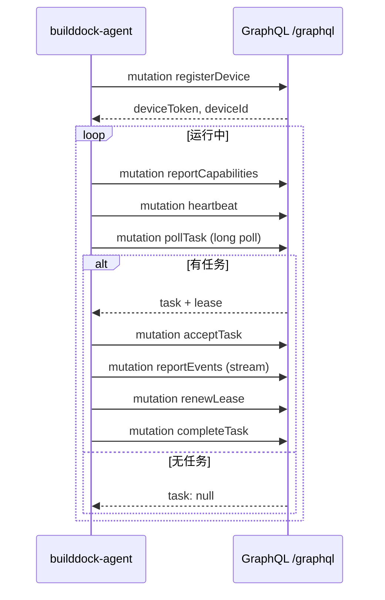

# Agent 协议

Schema Version: `1.0`

CLI Agent（`builddock-agent`）与平台之间的交互协议。

> Agent 通过 **GraphQL Mutation** 与平台通信，Endpoint 为 `POST /graphql`。  
> 完整 Schema 见 [`graphql-schema.graphql`](../api/graphql-schema.graphql)。

## 1. 设计原则

| 原则 | 说明 |
|------|------|
| 出站优先 | Agent 主动连平台，无需开入站端口 |
| GraphQL Mutation | 全部 Agent 操作走 Mutation，统一契约 |
| 长轮询领任务 | `pollTask` mutation，服务端阻塞至有任务或 timeout |
| Lease 防重复 | 任务分配带 lease，过期可 re-queue |
| 流式上报 | `reportEvents` 逐条/批量上报日志 |
| 幂等完成 | `completeTask` 带 leaseId，防重复提交 |

## 2. 认证

所有 Agent Mutation 使用 Device Token：

```http
POST /graphql
Authorization: Bearer dtok_xxx
Content-Type: application/json
```

Token 在 `registerDevice` mutation 时获取，见 [设备注册](./device-capability.md#3-设备注册)。

## 3. Agent 生命周期



## 4. CLI 命令

```bash
# 注册设备（使用 registration token）
builddock-agent register --token reg_xxx --name "my-macbook"

# 启动 Agent 守护进程
builddock-agent start

# 查看本地状态
builddock-agent status

# 停止
builddock-agent stop
```

### 4.1 register

1. 采集本机 fingerprint
2. 探测 handlers、runtimes
3. 调用 `registerDevice` mutation
4. 将 `deviceToken` 写入本地配置（`~/.builddock/config.yaml`）

### 4.2 start

1. 加载本地配置
2. 调用 `reportCapabilities` mutation
3. 启动 heartbeat 循环
4. 进入 `pollTask` 循环

## 5. GraphQL 交互详情

### 5.1 设备注册

```graphql
mutation Register($input: RegisterDeviceInput!) {
  registerDevice(input: $input) {
    device { id approvalStatus }
    deviceToken
    pollIntervalMs
    heartbeatIntervalMs
  }
}
```

Variables：

```json
{
  "input": {
    "registrationToken": "reg_xxx",
    "fingerprint": {
      "machineId": "a1b2c3...",
      "hostname": "dev-mac.local",
      "platform": "darwin",
      "arch": "arm64"
    },
    "name": "macbook-pro-m3",
    "labels": { "owner": "alice" },
    "capabilities": {}
  }
}
```

### 5.2 上报 Capability

```graphql
mutation ReportCapabilities($input: ReportCapabilitiesInput!) {
  reportCapabilities(input: $input) {
    success
    errors { code message }
  }
}
```

Input 结构见 [Capability Report](./device-capability.md#4-capability-report)（字段名转为 camelCase）。

### 5.3 心跳

```graphql
mutation Heartbeat($input: HeartbeatInput!) {
  heartbeat(input: $input) {
    pollIntervalMs
    heartbeatIntervalMs
  }
}
```

Variables：

```json
{
  "input": {
    "deviceId": "dev_01JABC...",
    "generation": 43,
    "status": "ONLINE",
    "load": {
      "cpuUsage": 0.41,
      "memoryUsage": 0.58,
      "activeTasks": 2,
      "availableSlots": 1
    },
    "runningTaskIds": ["task_01..."]
  }
}
```

### 5.4 领取任务（长轮询）

```graphql
mutation PollTask($input: PollTaskInput!) {
  pollTask(input: $input) {
    task {
      id
      lease { leaseId expiresAt }
      spec
      resolvedSecrets
    }
  }
}
```

Variables：

```json
{
  "input": {
    "deviceId": "dev_01JABC...",
    "generation": 43,
    "availableSlots": 1,
    "supportedTypes": ["SHELL", "SCRIPT"],
    "timeoutMs": 30000
  }
}
```

- 有任务：返回 `task`
- 无任务：`task` 为 `null`，Agent 等待 `pollIntervalMs` 后重试

### 5.5 接受任务

```graphql
mutation AcceptTask($input: AcceptTaskInput!) {
  acceptTask(input: $input) {
    success
    errors { code message }
  }
}
```

Variables：

```json
{
  "input": {
    "taskId": "task_01JXYZ...",
    "leaseId": "lease_xxx",
    "generation": 43
  }
}
```

lease 无效或 generation 不匹配：`errors[].code = CONFLICT`。

### 5.6 续租

```graphql
mutation RenewLease($input: RenewLeaseInput!) {
  renewLease(input: $input) {
    lease { leaseId expiresAt }
  }
}
```

建议每 30 秒或 lease 过期前 50% 续租一次。

### 5.7 上报事件

单条或多条：

```graphql
mutation ReportEvents($input: ReportEventsInput!) {
  reportEvents(input: $input) {
    success
  }
}
```

Variables：

```json
{
  "input": {
    "taskId": "task_01JXYZ...",
    "events": [
      {
        "type": "LOG",
        "data": { "stream": "stdout", "line": "PASS utils.test.ts" }
      },
      {
        "type": "PROGRESS",
        "data": { "percent": 50, "message": "Testing..." }
      }
    ]
  }
}
```

### 5.8 上传产物

```graphql
mutation PrepareUpload($input: PrepareArtifactUploadInput!) {
  prepareArtifactUpload(input: $input) {
    artifactId
    uploadUrl
  }
}
```

流程：

1. `prepareArtifactUpload` → 获取 `uploadUrl`
2. `HTTP PUT` 文件到 `uploadUrl`
3. `confirmArtifactUpload` 确认
4. `completeTask` 时传入 `artifactIds`

```graphql
mutation ConfirmUpload($input: ConfirmArtifactUploadInput!) {
  confirmArtifactUpload(input: $input) {
    id
    name
    url
  }
}
```

### 5.9 提交结果

```graphql
mutation CompleteTask($input: CompleteTaskInput!) {
  completeTask(input: $input) {
    success
    errors { code message }
  }
}
```

Variables：

```json
{
  "input": {
    "taskId": "task_01JXYZ...",
    "leaseId": "lease_xxx",
    "result": {
      "status": "SUCCEEDED",
      "exitCode": 0,
      "startedAt": "2026-07-30T15:00:05Z",
      "finishedAt": "2026-07-30T15:04:32Z",
      "durationMs": 267000,
      "output": {
        "stdoutRef": "log://task_01JXYZ/stdout",
        "stderrRef": "log://task_01JXYZ/stderr"
      },
      "artifactIds": ["art_xxx"]
    }
  }
}
```

重复 complete：`errors[].code = CONFLICT`。

## 6. Executor 接口（Agent 内部）

Agent 内部按 task type 分发到 executor：

```go
type Executor interface {
    Type() string
    Execute(ctx context.Context, spec TaskSpec, env ExecEnv) (*ExecResult, error)
}

type ExecEnv struct {
    WorkingDir string
    Env        map[string]string
    Secrets    map[string]string
    EventSink  EventSink
}

type EventSink interface {
    Log(stream string, line string)
    Progress(percent int, message string)
}

type ExecResult struct {
    ExitCode   int
    Structured map[string]any
}
```

### 6.1 MVP Executors

| Executor | 说明 |
|----------|------|
| `ShellExecutor` | 执行 `payload.command` |
| `ScriptExecutor` | 写入临时脚本文件后执行 |

### 6.2 执行流程

```
1. 解析 spec.type → 选择 Executor
2. 创建工作目录
3. 注入 env + resolvedSecrets
4. 启动进程，stdout/stderr → reportEvents(LOG)
5. 等待进程结束或超时
6. 收集 artifacts → prepareArtifactUpload → PUT → confirm
7. completeTask
```

## 7. GraphQL 客户端（Agent 内部）

Agent 推荐使用轻量 HTTP 客户端发送 GraphQL POST，无需完整 GraphQL 库：

```go
type GraphQLClient struct {
    Endpoint string
    Token    string
}

func (c *GraphQLClient) Mutate(ctx context.Context, query string, variables any, result any) error {
    // POST /graphql with Authorization: Bearer dtok_xxx
}
```

或使用 `shurcooL/graphql` 生成类型安全客户端。

## 8. 错误处理

| 场景 | Agent 行为 |
|------|-----------|
| GraphQL 网络中断 | 本地缓冲 events，重连后补发 |
| 执行超时 | kill 进程，completeTask status=FAILED |
| 平台 cancel | 下次 pollTask/heartbeat 感知 → kill，completeTask CANCELLED |
| renewLease 失败 | 停止执行，不 complete（平台 re-queue） |
| 进程非零退出 | completeTask status=FAILED |

## 9. 本地配置

`~/.builddock/config.yaml`：

```yaml
graphql_url: https://api.builddock.example.com/graphql
device_id: dev_01JABC...
device_token: dtok_xxx
name: macbook-pro-m3
working_dir: /tmp/builddock
max_concurrent_tasks: 3
log_level: info
```

## 10. 安全

Agent 侧须落实 [安全架构](../architecture/security.md#4-执行面cli-agent) 与 [安全要求](./security.md) MVP 清单。

| 措施 | 说明 |
|------|------|
| Token 存储 | 本地文件权限 0600；不进 env、不写日志 |
| Secrets | `resolvedSecrets` 仅任务执行期在内存；完成后清零 |
| 不受信任务 | `trustLevel=UNTRUSTED` → 拒绝（MVP 仅 TRUSTED） |
| 工作目录 | 限定在 Agent workspace；防路径穿越 |
| 环境变量 | 默认不继承用户 shell；仅 spec.env + resolvedSecrets |
| 命令执行 | MVP 直接 shell；V2 sandbox |
| 风险提示 | 首次 `start` 输出风险摘要（见安全要求 §5） |

## 11. MVP 裁剪

| 能力 | MVP | V2 |
|------|-----|-----|
| GraphQL Mutation 全套 | ✅ | |
| pollTask 长轮询 | ✅ | |
| GraphQL Subscription（Agent 收 cancel） | | ✅ |
| 批量 reportEvents | ✅ | |
| plugin executor | | ✅ |
| sandbox | | ✅ |
