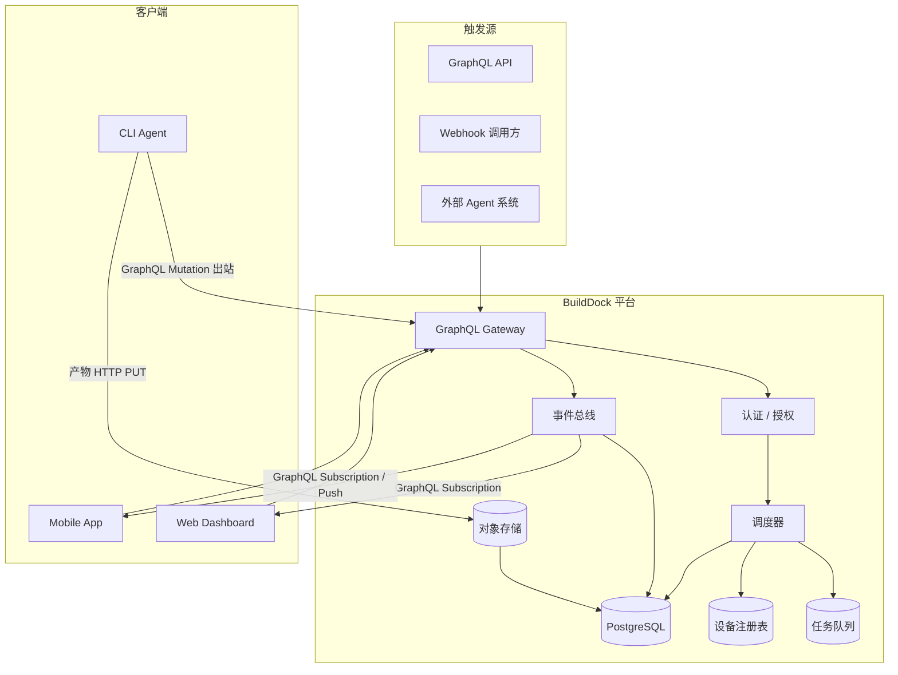

# 系统架构

## 1. 架构总览



## 2. 核心组件

### 2.1 GraphQL Gateway

- 统一 GraphQL 入口：`POST /graphql`（Query / Mutation）、`WS /graphql`（Subscription）
- 认证：API Key（触发方）、Device Token（Agent）、Registration Token（注册）
- 限流、审计日志、Persisted Queries（可选）
- Schema 定义：[`docs/api/graphql-schema.graphql`](../api/graphql-schema.graphql)

### 2.2 调度器（Scheduler）

- 接收新任务，写入队列
- 根据 Placement 约束匹配设备
- 分配 Lease，防止重复执行
- 处理超时、重试、取消

### 2.3 设备注册表（Device Registry）

- 设备身份、指纹、审批状态
- 最新 Capability Report
- 在线状态、最后心跳

### 2.4 任务队列

- MVP 推荐：PostgreSQL + `SKIP LOCKED` 或 Redis Streams
- 任务状态持久化
- 支持优先级与 deadline

### 2.5 事件总线

- 任务生命周期事件
- 日志流转发
- 推送到 Web/Mobile（GraphQL Subscription）、Webhook（HTTP POST 出站）

### 2.6 对象存储

- 产物（artifacts）
- 大体积日志归档
- S3 兼容（MinIO / AWS S3 / 阿里云 OSS）

### 2.7 CLI Agent

- 运行在用户设备上的轻量守护进程
- 出站连接，NAT 友好
- 内置 Task Executor（shell、script 等）

## 3. 通信模式

### 3.1 设计原则：出站优先

用户设备通常在 NAT/防火墙后，**Agent 主动连平台**，不要求开入站端口。

| 通道 | 方向 | 用途 | MVP |
|------|------|------|-----|
| GraphQL Mutation | Agent → Platform | 心跳、pollTask、事件、结果 | ✅ |
| GraphQL Query | 触发方 / Web → Platform | 查询设备、任务 | ✅ |
| GraphQL Subscription | Platform → Web/Mobile | 实时日志与状态 | ✅ |
| HTTP PUT | Agent → ObjectStore | 产物上传（预签名 URL） | ✅ |
| GraphQL Subscription | Platform → Agent | cancel 信号 | V2 |

### 3.2 Agent 工作循环

```
register → report capabilities → heartbeat loop
                                      │
                    ┌─────────────────┘
                    ▼
              poll for task (long poll)
                    │
         ┌──────────┴──────────┐
         ▼                     ▼
    no task (retry)      task received
                              │
                              ▼
                    accept + renew lease
                              │
                              ▼
                    execute locally
                              │
                    stream events/logs
                              │
                              ▼
                    submit result + artifacts
                              │
                              └──────→ poll again
```

## 4. 数据流

### 4.1 创建任务

```
Client mutation createTask
  → 校验 spec + placement
  → 写入 tasks 表（status=pending）
  → 入队（status=queued）
  → 调度器尝试 match device
  → 若匹配成功：assign lease（status=assigned）
  → Subscription 推送 taskUpdated / taskCreated
  → 触发 webhook（若配置）
```

### 4.2 执行任务

```
Agent mutation pollTask（服务端长轮询）
  → 返回 assigned 任务 + lease
  → Agent mutation acceptTask（status=running）
  → Agent mutation reportEvents（流式）
  → Agent mutation renewLease
  → Agent HTTP PUT artifacts + mutation completeTask
  → status=succeeded/failed
  → Subscription 推送 taskEventStream / taskUpdated
```

### 4.3 设备离线

```
心跳超时（2 × heartbeat_interval）
  → device.status = offline
  → 该设备 assigned 但未 running 的任务：lease 过期 → re-queue
  → running 任务：等待 lease 超时 → 标记 failed 或 re-queue（可配置）
```

## 5. 安全架构

| 层级 | 措施 |
|------|------|
| 传输 | 全程 TLS |
| 认证 | API Key / Device Token / Registration Token |
| 设备 | 指纹绑定、可选人工审批 |
| 任务 | trust_level、secrets 按任务注入、用后销毁 |
| 执行 | MVP 仅 trusted；V2 增加 sandbox |
| 审计 | 任务创建、设备注册、执行结果全链路记录 |

## 6. 部署拓扑（MVP）

```
┌─────────────────────────────────────┐
│           平台（单集群）              │
│  ┌─────────┐  ┌──────────────────┐  │
│  │ GraphQL │  │ PostgreSQL       │  │
│  │ Server  │──│ Redis (optional) │  │
│  └─────────┘  └──────────────────┘  │
│  ┌─────────┐  ┌──────────────────┐  │
│  │ Web SPA │  │ MinIO / S3       │  │
│  └─────────┘  └──────────────────┘  │
└─────────────────────────────────────┘
          ▲                ▲
          │ HTTPS 出站    │ HTTPS 出站
    ┌─────┴─────┐   ┌────┴─────┐
    │ MacBook   │   │ Linux PC │
    │ CLI Agent │   │ CLI Agent│
    └───────────┘   └──────────┘
```

## 7. 技术选型建议

| 组件 | 建议 | 理由 |
|------|------|------|
| Agent CLI | Go | 单二进制、跨平台，Buildkite/Semaphore 验证 |
| GraphQL Server | Go（gqlgen）/ Rust（async-graphql） | 类型安全、Subscription 支持 |
| 数据库 | PostgreSQL | 任务状态、SKIP LOCKED 队列 |
| 缓存/队列 | Redis Streams（可选） | 高吞吐事件 |
| 对象存储 | S3 兼容 | 产物与日志归档 |
| Web | React / Next.js | Dashboard |
| 实时推送 | GraphQL Subscription（graphql-transport-ws） | 与 Query/Mutation 统一 Schema |

## 8. 扩展路径

1. **MVP**：单租户、shell/script、Web + CLI
2. **V1.1**：设备组、多种 placement strategy、MCP
3. **V2**：Mobile、plugin task、composite workflow
4. **Enterprise**：多租户 RBAC、SSO、审计导出、私有部署
