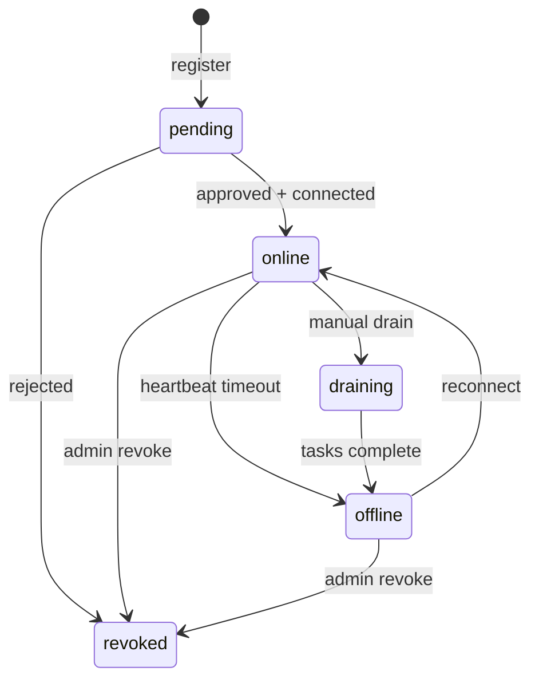

# Device Capability 模型

Schema Version: `1.0`

## 1. 概述

Device Capability 描述**用户设备能做什么**，是任务调度（Placement）的核心输入。

Capability 分三层：

| 层级 | 内容 | 更新频率 |
|------|------|----------|
| Static Labels | 人可读标签（owner、env、gpu） | 低 |
| Structured Caps | 机器可读（handlers、runtimes、resources） | 中 |
| Dynamic State | 实时负载（load、slots、active_tasks） | 每次心跳 |

## 2. Device 实体

```json
{
  "id": "dev_01JABC...",
  "org_id": "org_xxx",
  "name": "macbook-pro-m3",
  "status": "online",
  "approval_status": "approved",
  "fingerprint": {
    "machine_id": "a1b2c3...",
    "hostname": "dev-mac.local",
    "platform": "darwin",
    "arch": "arm64"
  },
  "agent": {
    "version": "0.1.0",
    "cli": "builddock-agent",
    "connected_at": "2026-07-30T10:00:00Z",
    "last_seen_at": "2026-07-30T15:04:00Z"
  },
  "labels": {
    "owner": "alice",
    "env": "dev",
    "team": "platform"
  },
  "created_at": "2026-07-30T09:00:00Z",
  "updated_at": "2026-07-30T15:04:00Z"
}
```

### 2.1 字段说明

| 字段 | 类型 | 说明 |
|------|------|------|
| `id` | string | 设备唯一 ID，前缀 `dev_` |
| `org_id` | string | 所属组织 |
| `name` | string | 用户可读名称 |
| `status` | enum | `pending` / `online` / `offline` / `draining` / `revoked` |
| `approval_status` | enum | `pending` / `approved` / `rejected` |
| `fingerprint` | object | 机器指纹，防 token 复用 |
| `agent` | object | Agent 版本与连接信息 |
| `labels` | object | 静态标签，用于路由 |

### 2.2 设备状态



| 状态 | 含义 |
|------|------|
| `pending` | 已注册，待审批或未首次连接 |
| `online` | 心跳正常，可接收任务 |
| `offline` | 心跳超时 |
| `draining` | 不再分配新任务，等待现有任务完成 |
| `revoked` | 已吊销，不可再用 |

## 3. 设备注册

### 3.1 请求

GraphQL Mutation `registerDevice`（使用 Registration Token 认证）：

```graphql
mutation Register($input: RegisterDeviceInput!) {
  registerDevice(input: $input) {
    device { id approvalStatus }
    deviceToken
    pollIntervalMs
    heartbeatIntervalMs
  }
}
```

Variables：

```json
{
  "input": {
    "registrationToken": "reg_xxx",
    "fingerprint": {
      "machineId": "a1b2c3...",
      "hostname": "dev-mac.local",
      "platform": "darwin",
      "arch": "arm64"
    },
    "name": "macbook-pro-m3",
    "labels": { "owner": "alice" },
    "capabilities": {}
  }
}
```

`capabilities` 结构见 [§4 Capability Report](#4-capability-report)。

### 3.2 响应

`registerDevice` 返回：

```json
{
  "data": {
    "registerDevice": {
      "device": {
        "id": "dev_01JABC...",
        "approvalStatus": "PENDING"
      },
      "deviceToken": "dtok_xxx",
      "pollIntervalMs": 3000,
      "heartbeatIntervalMs": 30000
    }
  }
}
```

| 字段 | 说明 |
|------|------|
| `device_token` | 后续所有 Agent API 的 Bearer Token |
| `poll_interval_ms` | 任务轮询建议间隔 |
| `heartbeat_interval_ms` | 心跳建议间隔 |

### 3.3 注册 Token 获取

GraphQL Mutation `createRegistrationToken`（API Key 认证）：

```graphql
mutation CreateRegToken($input: CreateRegistrationTokenInput!) {
  createRegistrationToken(input: $input) {
    token
    expiresAt
  }
}
```

Variables：

```json
{
  "input": {
    "orgId": "org_xxx",
    "expiresInSec": 3600,
    "labels": { "owner": "alice" }
  }
}
```

## 4. Capability Report

设备注册或周期性上报完整能力时使用。

```json
{
  "schema_version": "1.0",
  "device_id": "dev_01JABC...",
  "reported_at": "2026-07-30T15:04:00Z",
  "generation": 42,

  "system": {
    "platform": "darwin",
    "arch": "arm64",
    "os_version": "15.5",
    "hostname": "dev-mac.local"
  },

  "resources": {
    "cpu_cores": 12,
    "memory_bytes": 34359738368,
    "disk_free_bytes": 214748364800,
    "gpu": [
      {
        "name": "Apple M3 Pro",
        "vendor": "apple",
        "memory_bytes": 18446744073709551615
      }
    ]
  },

  "load": {
    "cpu_usage": 0.35,
    "memory_usage": 0.62,
    "active_tasks": 1,
    "available_slots": 2
  },

  "network": {
    "egress": "full",
    "private_reachable": ["github.com"],
    "tags": ["corp-vpn"]
  },

  "runtimes": [
    { "name": "node", "version": "22.4.0" },
    { "name": "python", "version": "3.12.4" },
    { "name": "docker", "version": "27.0.0" },
    { "name": "xcode", "version": "16.0" }
  ],

  "handlers": [
    { "type": "shell", "version": "1.0", "enabled": true },
    { "type": "script", "version": "1.0", "enabled": true, "languages": ["bash", "python", "node"] },
    { "type": "http", "version": "1.0", "enabled": true },
    { "type": "docker", "version": "1.0", "enabled": true },
    { "type": "plugin", "version": "1.0", "enabled": true, "plugins": ["browser", "git", "screenshot"] }
  ],

  "labels": {
    "owner": "alice",
    "env": "dev",
    "gpu": "true",
    "os": "macos"
  },

  "constraints": {
    "max_concurrent_tasks": 3,
    "max_task_timeout_sec": 7200,
    "allow_untrusted_tasks": false
  }
}
```

### 4.1 分组说明

| 分组 | 用途 | 更新频率 |
|------|------|----------|
| `system` | 平台 / 架构 / OS | 低 |
| `resources` | 硬件上限 | 低 |
| `load` | 调度软约束 | 每次心跳 |
| `network` | 网络可达性 | 中 |
| `runtimes` | 已安装 toolchain | 中 |
| `handlers` | 支持的 task type | 低 |
| `labels` | 标签路由 | 低 / 中 |
| `constraints` | Agent 侧限制 | 低 |

### 4.2 Handlers

`handlers[]` 表示设备 Agent **能执行哪些 task type**。平台只把匹配 handler 的任务分给该设备。

扩展新 task type 时：

1. 定义新的 `TaskSpec.type`
2. Agent 实现对应 executor
3. 注册时在 `handlers[]` 中声明

### 4.3 generation

单调递增整数，用于 lease fencing：任务分配时记录设备 `generation`，若心跳 generation 不一致则 lease 失效，防止脑裂重复执行。

## 5. 心跳（轻量 Capability）

不必每次全量上报：

GraphQL Mutation `heartbeat`：

```graphql
mutation Heartbeat($input: HeartbeatInput!) {
  heartbeat(input: $input) {
    pollIntervalMs
    heartbeatIntervalMs
  }
}
```

Variables：

```json
{
  "input": {
    "deviceId": "dev_01JABC...",
    "generation": 43,
    "status": "ONLINE",
    "load": {
      "cpuUsage": 0.41,
      "memoryUsage": 0.58,
      "activeTasks": 2,
      "availableSlots": 1
    },
    "runningTaskIds": ["task_01...", "task_02..."]
  }
}
```

### 5.1 离线判定

```
last_seen_at + 2 × heartbeat_interval < now  →  status = offline
```

离线设备的 assigned 但未 running 任务：lease 过期后 re-queue。

## 6. 设备组（V1.1）

```json
{
  "id": "grp_xxx",
  "name": "alice-devices",
  "device_ids": ["dev_01...", "dev_02..."],
  "labels": {
    "team": "platform"
  }
}
```

Placement 可通过 `group` 字段指定设备组内匹配。

## 7. 标签约定

### 7.1 推荐标准标签

| Key | 示例 | 用途 |
|-----|------|------|
| `owner` | `alice` | 任务路由到特定用户设备 |
| `env` | `dev` / `prod` | 环境隔离 |
| `os` | `macos` / `linux` / `windows` | 平台过滤 |
| `arch` | `arm64` / `amd64` | 架构过滤 |
| `gpu` | `true` / `false` | GPU 任务 |

### 7.2 自定义标签

使用命名空间避免冲突：

```json
{
  "labels": {
    "com.myorg.region": "cn-east",
    "com.myorg.tier": "gold"
  }
}
```

## 8. MVP 裁剪

| 字段 | MVP | V2 |
|------|-----|-----|
| `handlers` | `shell`, `script` | 全部 |
| `labels` | ✅ | ✅ |
| `load` | ✅ | ✅ |
| `runtimes` | ✅ | ✅ |
| `network` | ❌ | ✅ |
| `gpu` | ❌ | ✅ |
| `constraints.allow_untrusted_tasks` | ❌ | ✅ |
| `generation` / fencing | ✅ | ✅ |
