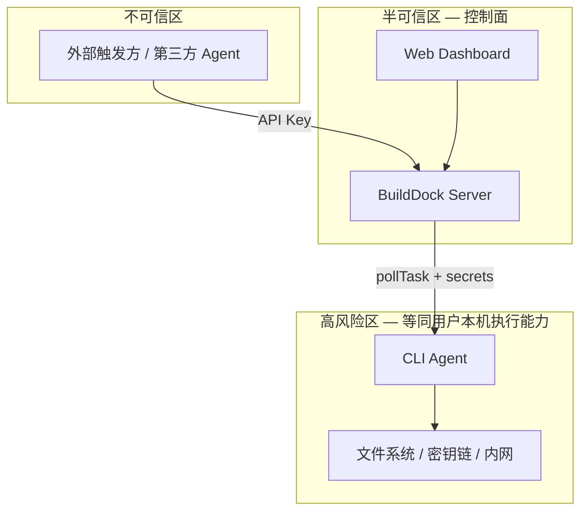

# 安全要求

Schema Version: `1.0`

BuildDock 允许经授权方通过 API 在用户设备上执行命令，**本质上是远程代码执行（RCE）能力**。本文定义产品侧安全目标、分阶段必须接入的措施，以及与 MVP 边界的对齐关系。

> 各组件实现细节见 [安全架构](../architecture/security.md)；认证与 Token 见 [认证与授权](../architecture/auth.md)。

## 1. 安全目标

| 优先级 | 目标 | 说明 |
|--------|------|------|
| P0 | 防止未授权远程执行 | 任务下发须经过身份、授权与策略校验 |
| P0 | 限制凭据泄露面 | API Key、Device Token、任务 Secrets 最小生命周期与可见范围 |
| P0 | 可检测、可阻断、可追责 | 异常可限流；关键操作可审计、Token 可吊销 |
| P1 | 限制单点沦陷爆炸半径 | 单个 Key / 设备 / 任务不应默认拖垮整个组织 |
| P1 | 用户知情与控制 | 用户明确 Agent 启动后的风险，并可审批设备与任务 |

### 1.1 信任边界

**产品结论**：在 MVP（直接 shell 执行、`trusted` 任务）下，持有组织 API Key 的主体等价于可向已批准设备下发命令。安全设计的核心是**约束谁、在什么条件下、能对哪些设备、执行何种任务**。

## 2. 威胁与缓解（摘要）

| 威胁 | 影响 | 主要缓解措施 | 阶段 |
|------|------|--------------|------|
| API Key 泄露 | 向组织设备批量下发恶意任务 | RBAC、rate limit、Key 吊销、scoped Key | MVP / V1.1 |
| Device Token 泄露 | 冒充设备、获取任务 Secrets | 0600 存储、device 绑定、revoke、Token 轮换 | MVP / V1.1 |
| Registration Token 抢注 | 植入恶意设备 | 短 TTL、一次性、**默认人工审批** | MVP |
| 越权任务调度 | 任务落到非预期设备 | Placement `required_labels`、设备组隔离 | MVP |
| 任务 Spec 恶意内容 | 破坏用户机器、窃取数据 | trust_level、working_dir 隔离、V2 sandbox | MVP / V2 |
| Web XSS 窃取 Key | 浏览器内 Key 泄露 | OAuth Session（V1.1）；MVP 限 dev 使用 | V1.1 |
| 日志 / 产物含 Secret | 二次泄露 | 短 TTL 预签名、V2 DLP | MVP / V2 |
| 平台被入侵 | 大规模恶意下发 | 审计、私有部署（Enterprise） | V1.1+ |

完整威胁模型与纵深防御见 [安全架构 §2–3](../architecture/security.md#2-威胁模型)。

## 3. 分阶段接入措施

以下措施**必须写入实现**，按阶段交付；未列阶段项不在该期承诺范围。

### 3.1 MVP（公开 Beta 前必须完成）

| # | 措施 | 说明 |
|---|------|------|
| 1 | **设备注册默认 PENDING + 人工审批** | 新设备不可接收任务，直至 `approveDevice`；见 [Device Capability §3](./device-capability.md#3-设备注册) |
| 2 | **Registration Token 短 TTL + 一次性** | 默认 1h；`used_at` 后失效 |
| 3 | **Token 哈希存储、禁止日志明文** | 见 [auth.md §4](../architecture/auth.md#4-token-设计) |
| 4 | **org 隔离 + RBAC 操作矩阵** | Resolver / Service 层强制 |
| 5 | **Device Token 仅操作自身 device 与 assigned 任务** | 防冒充设备 |
| 6 | **Placement labels 作为安全隔离** | `required_labels` 限制任务可落设备；见 [Task Schema §4](./task-schema.md#4-placement调度约束) |
| 7 | **trust_level：MVP 仅 TRUSTED；Agent 拒绝 UNTRUSTED** | 见 [Task Schema §3.2](./task-schema.md#32-trust_level) |
| 8 | **working_dir 隔离 + 防路径穿越** | 任务目录限定在 Agent 工作区 |
| 9 | **Secrets 按需注入、用后清零、不落日志** | `secretRefs` → `resolvedSecrets` → 内存销毁 |
| 10 | **生产禁止 createTask spec 明文 secret** | 仅允许 `secretRefs`（MVP 可无 secrets 表，但策略须拒绝明文） |
| 11 | **HTTPS / WSS 强制** | 生产环境 |
| 12 | **Rate limit** | API Key、IP；见 [auth.md §8](../architecture/auth.md#8-限流) |
| 13 | **Lease + fencing** | 防双执行；见 [调度器设计](../architecture/scheduler.md) |
| 14 | **结构化 audit 日志（关键事件）** | register / approve / revoke / createTask / cancel / complete |
| 15 | **用户风险披露** | Web 添加设备页、CLI `start` 提示 |
| 16 | **config.yaml 权限 0600、Token 不进 env** | 见 [Agent 协议 §10](./agent-protocol.md#10-安全) |

### 3.2 V1.1

| # | 措施 | 说明 |
|---|------|------|
| 1 | API Key **scope**（如 `task:create`、`device:read`）与**过期时间** | 缩小泄露影响面 |
| 2 | **Device Token 轮换** | `rotateDeviceToken` + CLI 更新 config |
| 3 | **Web OAuth Session**；API Key 仅用于 CI / 机器 | 替代 localStorage 存 Key |
| 4 | **任务审批流** | 含 `secretRefs` 或首条 shell 等策略触发 `PENDING_APPROVAL` |
| 5 | **Policy 引擎** | 基于 labels、trust_level、spec 类型的组织 / 设备规则 |
| 6 | **Secrets 表 + KMS 加密** | 替代 env 明文写入 spec |
| 7 | **Webhook HMAC + timestamp 防重放** | 见 [API 概览](./api-overview.md) |
| 8 | **GraphQL 加固** | query depth/complexity 限制；生产关闭 introspection |
| 9 | **Agent 本地二次策略** | 敏感路径 denylist、trust 不匹配拒绝 |
| 10 | **audit_logs 落库 + Dashboard** | 可查询审计 |
| 11 | **产物 / 日志下载鉴权** | 预签名 URL + org / task 归属校验 |

### 3.3 V2 / Enterprise

| # | 措施 | 说明 |
|---|------|------|
| 1 | **UNTRUSTED 任务 + Sandbox 执行** | 与 [产品概述 §7 第二期](./overview.md#7-mvp-边界) 一致 |
| 2 | 命令 / handler **allowlist** | 配合 sandbox 或强隔离 |
| 3 | 任务级**网络 egress 控制** | 如 spec.networkPolicy |
| 4 | **设备密钥对 + 请求签名** | 防 dtok 拷贝至其他机器 |
| 5 | **CLI 发布签名 + install.sh 校验** | 供应链 |
| 6 | 日志 / 产物 **DLP 脱敏** | 防 stdout 泄露 secret |
| 7 | 细粒度 RBAC、SSO、私有部署、mTLS、SIEM | Enterprise |

## 4. 产品与策略默认值

| 策略 | MVP 默认值 | 说明 |
|------|------------|------|
| 新设备 `approval_status` | `PENDING` | 须管理员 `approveDevice` |
| 组织 `require_device_approval` | `true` | 可配置关闭（不推荐生产） |
| 任务 `trust_level` | `TRUSTED` | MVP 不接受 UNTRUSTED |
| 个人设备接收含 secret 任务 | 默认 **禁止** | 通过 labels（如 `tier=personal`）+ Policy（V1.1） |
| Web 使用 API Key | 仅 **开发环境** | 生产走 OAuth（V1.1） |
| Agent 继承用户全量 shell env | 默认 **否** | 仅 spec.env + resolvedSecrets |

## 5. 用户责任与披露

Web「添加设备」页与 CLI 文档须包含等价说明：

> 启动 Agent（`builddock-agent start`）后，持有本组织 API Key 的授权方可向本机下发命令。请完成设备审批、使用标签隔离设备，并避免在存放敏感数据的个人电脑上运行高权限 Agent。

建议 CLI 首次 `start` 时输出风险摘要（可 `--acknowledge-risk` 跳过二次提示，V1.1）。

## 6. 与 MVP 边界对齐

| MVP 模块 | 安全约束 |
|----------|----------|
| 任务类型 `shell` / `script` | 仅 TRUSTED；working_dir 隔离 |
| Placement | `required_labels` 作隔离边界 |
| 触发 GraphQL + Webhook | RBAC + rate limit + audit |
| CLI Agent | 0600、UNTRUSTED 拒绝、非 root 运行（文档建议） |
| Web Dashboard | 设备审批 UI；MVP Key 仅 dev |

第二期 `untrusted` + sandbox 未就绪前，**不得**对公网开放 UNTRUSTED 任务创建。

## 7. 相关文档

| 文档 | 说明 |
|------|------|
| [安全架构](../architecture/security.md) | 纵深防御、组件措施、审计事件 |
| [认证与授权](../architecture/auth.md) | Token、RBAC、限流 |
| [Task Schema — trust_level](./task-schema.md#32-trust_level) | 任务信任级别 |
| [Device Capability — 审批](./device-capability.md#32-设备状态) | 设备状态与审批 |
| [Agent 协议 — 安全](./agent-protocol.md#10-安全) | Agent 侧措施 |
| [CLI 架构 — 安全](../architecture/cli.md#10-安全) | Executor 与本地配置 |
