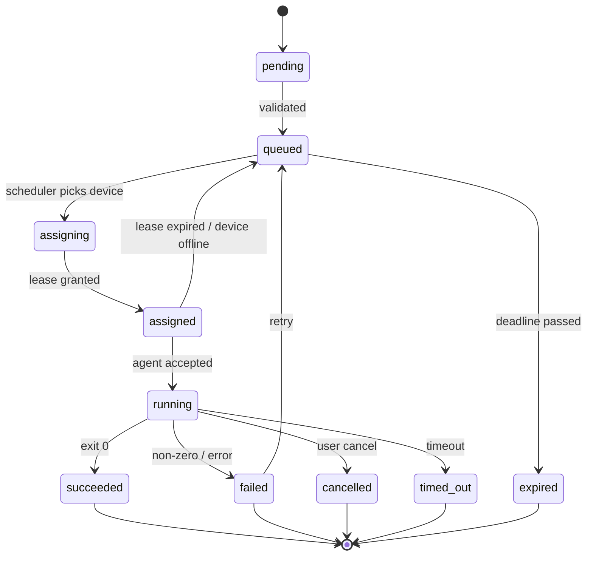

# Task Schema

Schema Version: `1.0`

## 1. 概述

Task 是 BuildDock 的核心资源，表达「要执行什么」以及「如何调度」。

Task 拆成四块：

```
Task
├── spec        创建时确定，不可变
├── placement   调度约束
├── runtime     执行态，可变
└── result      完成后写入
```

## 2. Task 顶层结构

```json
{
  "id": "task_01JXYZ...",
  "org_id": "org_xxx",
  "schema_version": "1.0",
  "spec": {},
  "placement": {},
  "runtime": {},
  "result": null,
  "created_by": {
    "type": "api_key",
    "id": "key_xxx",
    "subject": "agent:session-123"
  },
  "created_at": "2026-07-30T15:00:00Z",
  "updated_at": "2026-07-30T15:05:00Z"
}
```

## 3. TaskSpec（不可变）

```json
{
  "type": "shell",
  "name": "run-tests",
  "description": "Execute project test suite",
  "payload": {},
  "timeout_sec": 1800,
  "retry": {
    "max_attempts": 2,
    "backoff_sec": 10
  },
  "idempotency_key": "proj-abc:test:commit-9f3a",
  "env": {
    "NODE_ENV": "test"
  },
  "secrets": [
    { "ref": "sec/npm_token", "env": "NPM_TOKEN" }
  ],
  "working_dir": "/workspace/my-app",
  "artifacts": {
    "collect": [
      { "path": "coverage/**", "name": "coverage" },
      { "path": "test-results.xml" }
    ]
  },
  "callbacks": {
    "webhook": "https://example.com/hooks/builddock",
    "events": ["queued", "started", "progress", "completed", "failed"]
  },
  "trust_level": "trusted",
  "metadata": {
    "source": "custom-agent",
    "correlation_id": "run-12345"
  }
}
```

### 3.1 字段说明

| 字段 | 类型 | 必填 | 说明 |
|------|------|------|------|
| `type` | string | ✅ | 任务类型，决定 `payload` 结构 |
| `name` | string | ✅ | 任务名称 |
| `description` | string | | 描述 |
| `payload` | object | ✅ | 类型相关载荷 |
| `timeout_sec` | integer | ✅ | 硬超时（秒） |
| `retry` | object | | 平台侧重试策略 |
| `idempotency_key` | string | | 幂等创建键 |
| `env` | object | | 环境变量 |
| `secrets` | array | | 密钥引用（不下发明文） |
| `working_dir` | string | | 工作目录 |
| `artifacts` | object | | 需收集的产物路径 |
| `callbacks` | object | | Webhook 事件回调 |
| `trust_level` | enum | | `trusted` / `untrusted` / `system` |
| `metadata` | object | | 调用方自定义元数据 |

### 3.2 trust_level

| 值 | 含义 | MVP |
|----|------|-----|
| `trusted` | 组织内可信任务 | ✅ |
| `untrusted` | 外部 Agent 下发，需 sandbox | V2 |
| `system` | 平台维护任务 | V2 |

## 4. Placement（调度约束）

```json
{
  "mode": "capability_match",
  "device_id": null,
  "device_ids": [],
  "group": null,
  "required_labels": {
    "owner": "alice",
    "env": "dev"
  },
  "preferred_labels": {
    "gpu": "true"
  },
  "required_handlers": ["shell"],
  "required_runtimes": [
    { "name": "node", "version": ">=20.0.0" }
  ],
  "resource_requirements": {
    "min_memory_bytes": 2147483648,
    "min_disk_free_bytes": 1073741824
  },
  "network_requirements": {
    "egress": "full"
  },
  "strategy": "least_loaded",
  "schedule_at": null,
  "deadline_at": "2026-07-30T16:00:00Z"
}
```

### 4.1 mode

| mode | 行为 |
|------|------|
| `any` | 任意可用设备 |
| `device_id` | 指定单设备（`device_id` 必填） |
| `device_ids` | 设备列表中择优 |
| `group` | 设备组内匹配 |
| `capability_match` | 按 labels / handlers / runtimes / resources 匹配 |

### 4.2 strategy

| strategy | 说明 |
|----------|------|
| `fifo` | 先注册先服务 |
| `least_loaded` | 负载最低（默认） |
| `capability_score` | 软标签 + 资源综合打分 |
| `round_robin` | 组内轮询 |
| `sticky` | 同 idempotency_key / session 尽量同设备 |

## 5. TaskRuntime（可变）

```json
{
  "status": "running",
  "attempt": 1,
  "assigned_device_id": "dev_01JABC...",
  "lease": {
    "lease_id": "lease_xxx",
    "generation": 43,
    "expires_at": "2026-07-30T15:10:00Z"
  },
  "queued_at": "2026-07-30T15:00:01Z",
  "assigned_at": "2026-07-30T15:00:03Z",
  "started_at": "2026-07-30T15:00:05Z",
  "finished_at": null,
  "progress": {
    "percent": 45,
    "message": "Running tests..."
  },
  "cancel_requested": false,
  "failure_reason": null
}
```

### 5.1 状态机



| 状态 | 含义 |
|------|------|
| `pending` | 刚创建，校验中 |
| `queued` | 等待可用设备 |
| `assigning` | 正在分配 lease |
| `assigned` | 已分配，等待 Agent 领取 |
| `running` | 执行中 |
| `succeeded` | 成功（终态） |
| `failed` | 失败（终态，可重试回 queued） |
| `cancelled` | 已取消（终态） |
| `timed_out` | 超时（终态） |
| `expired` | 超过 deadline（终态） |

## 6. TaskResult

### 6.1 成功

```json
{
  "status": "succeeded",
  "exit_code": 0,
  "started_at": "2026-07-30T15:00:05Z",
  "finished_at": "2026-07-30T15:04:32Z",
  "duration_ms": 267000,
  "output": {
    "stdout_ref": "log://task_01JXYZ/stdout",
    "stderr_ref": "log://task_01JXYZ/stderr",
    "structured": {
      "tests_passed": 128,
      "tests_failed": 0,
      "coverage": 0.87
    }
  },
  "artifacts": [
    {
      "name": "coverage",
      "url": "https://storage.example.com/coverage.tar.gz",
      "size_bytes": 1048576,
      "content_type": "application/gzip"
    }
  ],
  "events_ref": "events://task_01JXYZ",
  "error": null
}
```

### 6.2 失败

```json
{
  "status": "failed",
  "exit_code": 1,
  "error": {
    "code": "EXECUTION_ERROR",
    "message": "Command exited with code 1",
    "details": {
      "command": "npm test",
      "last_stderr_line": "Error: 3 tests failed"
    }
  }
}
```

## 7. Task Type 与 Payload

采用 **discriminated union**：`type` 决定 `payload` 结构。

### 7.1 内建类型

| type | 用途 | handler 要求 | MVP |
|------|------|-------------|-----|
| `shell` | 单条 shell 命令 | `shell` | ✅ |
| `script` | 脚本文件或 inline | `script` | ✅ |
| `http` | HTTP 请求 | `http` | V2 |
| `docker` | 容器内执行 | `docker` | V2 |
| `plugin` | Agent 插件 | `plugin` | V2 |
| `agent_message` | 结构化 agent 指令 | `agent_message` | V2 |
| `composite` | 子任务编排 | 平台侧 | V2 |

### 7.2 shell

```json
{
  "type": "shell",
  "payload": {
    "command": "npm test",
    "shell": "/bin/bash",
    "cwd": "/workspace/my-app"
  }
}
```

### 7.3 script

```json
{
  "type": "script",
  "payload": {
    "language": "bash",
    "source": {
      "kind": "inline",
      "content": "#!/usr/bin/env bash\nset -euo pipefail\nnpm ci && npm test"
    },
    "args": [],
    "cwd": "/workspace/my-app"
  }
}
```

`source.kind` 还支持：

| kind | 结构 |
|------|------|
| `url` | `{ "kind": "url", "url": "https://..." }` |
| `git` | `{ "kind": "git", "repo": "...", "ref": "main", "path": "scripts/test.sh" }` |
| `artifact` | `{ "kind": "artifact", "artifact_id": "art_xxx" }` |

### 7.4 http（V2）

```json
{
  "type": "http",
  "payload": {
    "method": "POST",
    "url": "https://internal-api.example.com/run-job",
    "headers": { "Content-Type": "application/json" },
    "body": { "action": "sync" },
    "timeout_sec": 300,
    "expect_status": [200, 201]
  }
}
```

### 7.5 docker（V2）

```json
{
  "type": "docker",
  "payload": {
    "image": "node:22-alpine",
    "command": ["npm", "test"],
    "cwd": "/app",
    "mounts": [
      { "source": "/workspace/my-app", "target": "/app", "mode": "rw" }
    ],
    "env": { "CI": "true" }
  }
}
```

### 7.6 plugin（V2）

```json
{
  "type": "plugin",
  "payload": {
    "plugin": "browser",
    "action": "screenshot",
    "params": {
      "url": "http://localhost:3000",
      "full_page": true
    }
  }
}
```

### 7.7 agent_message（V2）

```json
{
  "type": "agent_message",
  "payload": {
    "protocol": "generic/v1",
    "intent": "execute_plan",
    "message": {
      "goal": "Run full validation pipeline",
      "steps": [
        { "tool": "shell", "input": { "command": "make lint" } },
        { "tool": "shell", "input": { "command": "make test" } }
      ],
      "context": {
        "repo": "github.com/org/app",
        "branch": "feature/x"
      }
    },
    "response_format": "json",
    "max_steps": 20
  }
}
```

## 8. Task Event

Web / Mobile 实时追踪依赖 event stream：

```json
{
  "id": "evt_01...",
  "task_id": "task_01JXYZ...",
  "device_id": "dev_01JABC...",
  "timestamp": "2026-07-30T15:01:00Z",
  "type": "log",
  "data": {
    "stream": "stdout",
    "line": "PASS src/utils.test.ts"
  }
}
```

| event type | 用途 | MVP |
|------------|------|-----|
| `status_changed` | 状态变更 | ✅ |
| `log` | stdout / stderr 行 | ✅ |
| `progress` | 百分比 / 阶段 | V2 |
| `artifact` | 产物就绪 | ✅ |
| `metric` | 自定义指标 | V2 |
| `tool_call` | agent 调 tool | V2 |
| `heartbeat` | 任务级心跳 | V2 |

## 9. Placement 匹配规则

调度器伪逻辑：

```
for each online, approved device:
  skip if available_slots <= 0
  skip if device_id specified and not match
  skip if required_labels not satisfied
  skip if required_handlers not supported
  skip if required_runtimes not satisfied
  skip if resource_requirements not met
  skip if untrusted task and device.disallow_untrusted
  score = compute(preferred_labels, load, sticky)
  add to candidates

return sort(candidates, strategy)[0]
```

- **硬约束**：labels、handlers、runtimes、resources、trust
- **软约束**：preferred_labels、load、sticky

## 10. 完整示例

### 10.1 创建

```graphql
mutation CreateTask($input: CreateTaskInput!) {
  createTask(input: $input) {
    id
    runtime { status }
  }
}
```

Variables：

```json
{
  "input": {
    "spec": {
      "type": "SCRIPT",
      "name": "validate-pr",
      "payload": {
        "language": "bash",
        "source": {
          "kind": "inline",
          "content": "#!/usr/bin/env bash\nnpm ci\nnpm run lint\nnpm test\nnpm run build"
        },
        "cwd": "/workspace/app"
      },
      "timeoutSec": 3600,
      "artifactCollect": [
        { "path": "dist/**" },
        { "path": "test-report.xml" }
      ],
      "trustLevel": "TRUSTED",
      "metadata": { "source": "custom-agent", "pr": "123" }
    },
    "placement": {
      "mode": "CAPABILITY_MATCH",
      "requiredLabels": { "owner": "alice" },
      "requiredHandlers": ["script"],
      "requiredRuntimes": [{ "name": "node", "version": ">=20" }],
      "strategy": "LEAST_LOADED"
    }
  }
}
```

### 10.2 响应

```json
{
  "data": {
    "createTask": {
      "id": "task_01JXYZ...",
      "runtime": { "status": "QUEUED" }
    }
  }
}
```

实时追踪通过 GraphQL Subscription：

```graphql
subscription TaskEvents($taskId: ID!) {
  taskEventStream(taskId: $taskId) {
    type
    timestamp
    data
  }
}
```

## 11. 版本与扩展

- 所有顶层对象带 `schema_version`
- 新增字段向后兼容，旧客户端忽略未知字段
- 扩展 task type：定义 `type` + `payload`，Agent 声明 `handlers[]`
- 扩展 capability：使用命名空间 labels（`com.myorg.*`）
